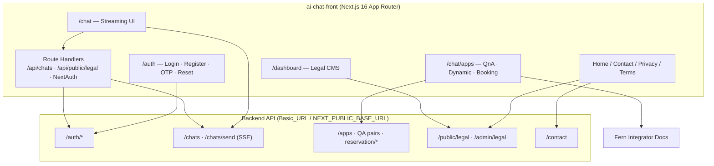

# Tuwaiq Intelligent Assistant — Portfolio Case Study

> Frontend platform for **Tuwaiq Intelligent Assistant** (in-product chat brand: **Tawan AI**).  
> Primary codebase: `ai-chat-front/` · Domain: [tuwaiq-ia.com](https://www.tuwaiq-ia.com)

Use this document as a source of truth for portfolio copy, case studies, and interview talking points. Copy sections as needed.

---

## 1. Project overview

**Tuwaiq Intelligent Assistant** is a bilingual (English / Arabic) AI platform that combines:

1. A **public streaming chat** experience on the platform itself  
2. A **chatbot builder** for websites — three deployable app types (QnA / Chat Bot, Dynamic Chat, Booking)  
3. Marketing surfaces (home, contact, legal) and a light **Admin CMS** for Privacy / Terms  

**Who it’s for**

- Businesses and website owners who want an embeddable AI assistant  
- End users who want to chat without setup (“Chat on our website”)  
- Integrators following the Fern API docs  
- Admins who maintain bilingual legal content  

**Brand identity (from the real UI)**

| Token | Value |
|--------|--------|
| Product / SEO name | **Tuwaiq Intelligent Assistant** |
| Chat chrome brand | **Tawan AI** (EN) / **توان AI** (AR) |
| Hero product phrase | **Smart Tuwaiq** |
| Logo | `ai-chat-front/public/assets/Icons/Logo.svg` (sparkle mark, green gradients `#005F33` → `#05F285`) |
| Primary accent | `#05F285` |
| Text / headings | `#173528` |
| Page background (light) | `#f4faf6` |
| Soft mint surfaces | `#dff9eb`, `#eef5f1`, `#f7fbf8`, `#f8fcf9` |
| Borders | `#dbe8df` |
| Dark surfaces | `#050807`, `#0D0F0E` |
| Primary CTA | Mint fill `#05F285`, text `#041009`, soft glow |
| Fonts | **Inter** (English), **Zain** (Arabic), **Geist Mono** (code) |
| UI direction | Light mint marketing + chat shell; dark contact/hero accents; shadcn + Tailwind v4 |

---

## 2. My role — Frontend Developer (React)

**Title framing:** Frontend Developer (React / Next.js)

**Scope I owned**

End-to-end frontend for the Tuwaiq Intelligent Assistant web product: App Router pages, bilingual layouts, auth UX, streaming chat UI, three apps (QnA / Dynamic / Booking) management flows, contact + legal public pages, and Admin legal CMS — integrated against a REST/SSE backend.

**Responsibilities**

- Designed and implemented public and authenticated routes under `src/app/[locale]/*`  
- Built the chat experience: welcome state, message list, markdown/code bubbles, SSE streaming send, URL deep-link via `?chatId=`  
- Delivered the Applications product surface: list/manage grids, create forms, QnA pair editing sheets, booking reservation setup (inventory + external provider)  
- Wired **next-auth** Credentials (login, JWT session, roles, refresh), forms with React Hook Form + Zod, and TanStack Query for server state  
- Implemented **next-intl** bilingual UX (EN/AR) with RTL/`dir` switching and locale-aware fonts  
- Built marketing home (hero, live preview, four feature cards), contact form, Privacy/Terms consumers, and TipTap-based Admin legal editor  
- Applied the mint brand system (tokens, CTAs, sidebar, shadcn components) consistently across light/dark themes  
- Added SEO helpers (metadata, sitemap public routes, structured data) and AdSense hooks  

**What I personally built / owned (portfolio-ready)**

- Streaming chat client with optimistic UX and markdown rendering  
- Soft-gated Applications hub (Dynamic / Chat Bot / Booking) with create + manage flows  
- Booking reservation configuration UI (resources, schedules, provider API fields)  
- Auth lifecycle UI: register → OTP verify → login → forgot/reset password  
- Admin RBAC gate for `/dashboard` + bilingual legal CMS editing  
- Full LTR/RTL-capable shell with Inter / Zain typography  

---

## 3. Problem / solution

**Problem**

Businesses need AI chat on their own sites (FAQ, general assistant, bookings) without building LLM infrastructure. Separately, visitors need a zero-friction way to try the assistant on the platform. Legal/content teams need bilingual Privacy/Terms without redeploying the app.

**Solution**

A Next.js frontend that:

- Offers **instant platform chat** at `/chat`  
- Lets authenticated users **create and manage three app types** under `/chat/apps/*`, each with an app id used as an API key toward the backend/docs  
- Serves **public marketing + contact + CMS-driven legal pages**  
- Restricts **Admin** legal editing behind role-based access  

---

## 4. High-level architecture



**Text view**

```
Browser (EN | AR, LTR | RTL)
   └─ Next.js App Router + next-intl + next-auth
         ├─ RSC pages / client islands (chat, forms, sheets)
         ├─ BFF: /api/auth/[...nextauth], /api/chats*, /api/public/legal/*
         └─ Server/client services → Backend REST + SSE
```

**Workspace note:** `ai-chat-front/` is the complete product. The parent `src/` tree is an older, thinner sibling (auth + chat + Coming Soon only). Portfolio claims below refer to **ai-chat-front**.

---

## 5. Full feature breakdown (major modules / screens)

### 5.1 Marketing home — `/[locale]`

**What it does:** Positions Tuwaiq as an AI chat + website chatbot platform and funnels users into chat or apps.

| Piece | Behavior |
|--------|-----------|
| **Header / Navbar** | Pill nav: Home, Chat, Contact Us, Applications dropdown; theme toggle; language switcher; Register / Login (or user menu) |
| **Hero content** | Headline + gradient “Smart Tuwaiq”; subcopy about website chat, custom assistants, bookings; CTAs “Start chatting now” → `/chat`, “Explore AI-powered tools” → `#ai-features` |
| **Hero visual preview** | Fake chat window (“Live experience”) with rotating Q&A pairs, status “AI is preparing the best answer”, metric chips (Platform chat / Instant, Website chat / Embed, Reservation / Easy) |
| **Features (`#ai-features`)** | Four cards from `FEATURE_CONFIG`: platform chat (public), Dynamic chatbot (login), QnA Chat Bot (login), Booking (login); docs links; login-required dialog when locked |
| **Footer** | © rights + Contact / Privacy Policy / Terms of Service |

### 5.2 Platform chat — `/[locale]/chat`

**What it does:** Core conversational product — talk to the assistant on Tuwaiq’s own site.

| Piece | Behavior |
|--------|-----------|
| **Dashboard shell** | Sidebar (Tawan AI logo, New conversation, app shortcuts, recent chats when logged in) + top Header |
| **WelcomeState** | Empty state: concentric mint arcs + welcome title/subtitle |
| **MessagesList / MessageBubble** | Conversation thread; assistant/user styling; **markdown** + **syntax-highlighted code** |
| **Typing / thinking** | “Thinking…” indicator while streaming |
| **ChatInput** | “Ask anything…”; first message can create a chat then stream |
| **Streaming send** | `POST …/chats/send` with SSE-style `data:` chunks (`chunk` / `done` / `error`) |
| **Deep link** | `nuqs` keeps `?chatId=` in the URL |
| **History** | Logged-in users load chats/messages via Next BFF `/api/chats*` with Bearer token |
| **Guest limit (implemented, currently disabled)** | `guest-limit.ts` + modal for 5 messages / 24h in `localStorage` — check commented out in send handler |

### 5.3 Applications — Chat Bot (QnA) — `/[locale]/chat/apps/qna`

**What it does:** Create and manage FAQ-style website chatbots (`appType: 1`).

| Piece | Behavior |
|--------|-----------|
| **Manage Apps** | Title/subtitle, View Docs (Fern), Create Chat Bot CTA |
| **Apps grid** | Cards with name, type, dates, masked app id labeled as API key (copy), edit affordances |
| **Create (`…/qna/add-update`)** | Name, common fallback answer, reference text and/or Q&A pairs, API key expiry days → `POST /apps` |
| **Edit Q&A sheet** | Update individual pairs via `PUT /apps/{id}/qa-pairs/{pairId}` |

### 5.4 Applications — Dynamic Chat — `/[locale]/chat/apps/dynamic`

**What it does:** Manage general-purpose site assistants (`appType: 3`).

| Piece | Behavior |
|--------|-----------|
| **Manage list** | Same AppsPage shell filtered to Dynamic |
| **Create** | Dialog: name + API key expiry days (`CreateDynamicChatDialog`) |
| **Manage extras** | List-focused (no QnA/booking sheets) |

### 5.5 Applications — Booking — `/[locale]/chat/apps/booking`

**What it does:** Manage in-chat appointment assistants (`appType: 2`).

| Piece | Behavior |
|--------|-----------|
| **Manage list** | Booking cards + Create Booking App |
| **Create (`…/booking/add-update`)** | Name, reservation rules text, required fields, expiry days |
| **Reservation setup sheet** | Hub for inventory vs external provider |
| **Inventory path** | TSV/spreadsheet-style paste or manual resources + recurring UTC schedules; batch APIs under `/apps/{id}/reservation/inventory/*` |
| **Provider path** | Configure partner base URL, availability/create/cancel paths, API key header/value |
| **Resource / slots UX** | Edit resources, inspect generated slots (calendar/day-picker powered) |

### 5.6 Contact — `/[locale]/contact`

**What it does:** Dark mint marketing contact page with form + static contact channels.

- Fields: Full Name, Email, Subject, Message (phone supported in schema/UI as applicable)  
- Submit → `POST /contact`  
- Displays `Info@tuwaiq-ia.com` and `+201146484873`  
- Success copy: message received / response within 24 hours  

### 5.7 Privacy & Terms — `/[locale]/privacy`, `/[locale]/terms`

**What it does:** Renders bilingual legal HTML from CMS (`GET /public/legal/{privacy|terms}`), with locale-aware body selection. Fallback static copy exists in `messages/*.json` if needed.

### 5.8 Auth — `/[locale]/auth/*`

| Route | Feature |
|--------|---------|
| `/auth/login` | Email + password → Credentials provider |
| `/auth/register` | Name, email, password, confirm → register API |
| `/auth/verify` | 6-digit OTP (email verify or password-reset path via `?type=`) |
| `/auth/password/forget` | Request recovery link / code |
| `/auth/password/reset` | Set new password |

Shared **AuthLayout**: Header + gradient-border card + `auth-bg.png` visual panel.

### 5.9 Admin dashboard — `/[locale]/dashboard*`

| Route | Feature |
|--------|---------|
| `/dashboard` | Admin shell placeholder |
| `/dashboard/legal/[legalName]` | TipTap rich-text editors for EN + AR legal bodies; save via admin legal APIs; create dialog for kinds |

---

## 6. Multiple surfaces (product vs admin)

There is one Next app (`ai-chat-front`), with two clear product surfaces:

### A. Public / end-user product

- Marketing home, Contact, Privacy, Terms  
- Platform chat  
- Auth funnel  
- Applications builder (intended for logged-in owners; soft-gated in UI)

### B. Admin surface

- `/dashboard` + `/dashboard/legal/[legalName]`  
- Requires session role **`Admin`**  
- Focused on bilingual legal CMS — not a full multi-tenant hospital console  

> This is **not** a multi-hospital clinical system; metrics below use placeholders for business outcomes, not invented hospital counts.

---

## 7. Auth, RBAC, dual modes

### Authentication

- **next-auth** Credentials → backend `POST /auth/login`  
- JWT session (~5 days); delayed refresh via `POST /auth/refresh-token` after wall-clock window  
- Session exposes `user.name`, `user.email`, `user.roles[]`, `accessToken`, `refreshToken`  
- Full lifecycle: register → verify email OTP → login → forgot → verify reset → reset password  

### Authorization / RBAC

| Gate | Mechanism |
|------|-----------|
| Auth pages | Logged-in users redirected home (`proxy.ts`) |
| `/dashboard*` | Must be authenticated **and** `roles` includes `"Admin"`; else redirect home |
| `/chat/apps*` | Soft gate: UI login dialogs / feature locks; APIs expect Bearer (not hard-blocked in middleware) |
| `/chat` | Public; richer history when authenticated |

### Dual modes

| Mode | Experience |
|------|------------|
| **Guest** | Use platform chat; Applications features prompt login |
| **Authenticated user** | Chat history, create/manage apps, booking setup |
| **Admin** | Legal CMS under `/dashboard` |
| **Locale mode** | `en` (LTR, Inter) vs `ar` (RTL, Zain) |
| **Theme mode** | Light / dark via `next-themes` (default dark in provider config) |

---

## 8. Tech stack tables

### Frontend app (`ai-chat-front`)

| Layer | Stack |
|--------|--------|
| Framework | **Next.js 16.2** (App Router), **React 19** |
| Language | **TypeScript** |
| Styling | **Tailwind CSS v4**, CSS variables, **shadcn/ui** (Radix), Lucide |
| Auth | **next-auth** v4 (Credentials + JWT) |
| i18n | **next-intl** (en/ar, RTL) |
| Forms / validation | **React Hook Form**, **Zod**, `@hookform/resolvers` |
| Server state | **TanStack Query** |
| URL state | **nuqs** (`chatId`) |
| Markdown / code | **react-markdown**, **react-syntax-highlighter** |
| Rich text (admin) | **TipTap** (+ related extensions) |
| Dates / booking UI | **date-fns**, **react-day-picker** |
| Toasts / theme | **sonner**, **next-themes** |
| OTP | **input-otp** |

### Backend integration (consumed APIs)

| Area | Endpoints (as used in code) |
|------|------------------------------|
| Auth | `/auth/register`, `/login`, `/refresh-token`, `/forgot-password`, `/verify-email`, `/verify-reset-code`, `/reset-password` |
| Chat | `POST /chats`, `POST /chats/send` (stream), `GET /chats`, `GET /chats/{id}/messages` |
| Apps | `GET`/`POST /apps`, `PUT /apps/{id}/qa-pairs/{qaPairId}` |
| Reservation | `/apps/{id}/reservation/inventory/batch`, `/resources`, `/provider`, … |
| Legal | `GET /public/legal/{name}`, `GET`/`POST`/`PUT /admin/legal…` |
| Contact | `POST /contact` |

Env bases: `Basic_URL` (server), `NEXT_PUBLIC_BASE_URL` (client mutations), `NEXTAUTH_SECRET`.

### Present but unused / secondary

| Item | Note |
|------|------|
| `zustand` | In package.json; no store usage found |
| `@tinymce/tinymce-react` | Installed; TipTap powers the legal editor |

---

## 9. Cross-cutting features

| Capability | Implementation |
|------------|----------------|
| **i18n + RTL** | `next-intl`; `dir`/`lang` on layout; Inter vs Zain; mirrored chrome |
| **Streaming chat** | SSE-like chunk protocol into live assistant bubbles |
| **Markdown / code chat** | react-markdown + syntax highlighter + code heuristics |
| **Deep linking** | `?chatId=` via nuqs |
| **Guest quotas** | localStorage limiter + modal (logic present; enforcement commented out) |
| **Apps API keys** | App id shown/copied on cards for integrators |
| **Fern docs** | Linked from apps + feature cards |
| **Booking inventory paste** | TSV / spreadsheet-style bulk paste (not ExcelJS export) |
| **External booking provider** | Configurable HTTP paths + API key header |
| **Legal CMS** | TipTap EN/AR → admin APIs → public legal pages |
| **Contact intake** | Validated form → backend |
| **SEO** | Metadata helpers, structured data, sitemap public-route list, Google verification env |
| **AdSense** | Script + `public/ads.txt` |
| **Theming** | next-themes light/dark with mint brand tokens |
| **FCM / maps / Stripe / Excel export library** | **Not in this codebase** |

---

## 10. Feature checklist

### Marketing & public

- [x] Bilingual home hero (Smart Tuwaiq)  
- [x] Live chat preview mock  
- [x] Four feature cards with login gates  
- [x] Contact page + form  
- [x] Privacy page (CMS-driven)  
- [x] Terms page (CMS-driven)  
- [x] Footer legal links  
- [x] SEO metadata / structured data hooks  
- [ ] Coming Soon page (component exists; not on live home)  

### Chat

- [x] Welcome empty state  
- [x] Create chat on first message  
- [x] SSE streaming replies  
- [x] Markdown + code rendering  
- [x] Thinking / typing indicator  
- [x] Recent chats sidebar (authenticated)  
- [x] `chatId` URL state  
- [x] Guest limit infrastructure  
- [ ] Guest limit enforced on send (commented out)  

### Applications

- [x] Manage Apps shell (docs + create CTA)  
- [x] QnA / Chat Bot create + list + pair edit  
- [x] Dynamic Chat create dialog + list  
- [x] Booking create + list  
- [x] Booking reservation inventory setup  
- [x] Booking external provider setup  
- [x] Resource / slots management UX  
- [ ] Hard middleware protection on `/chat/apps/*`  

### Auth & admin

- [x] Login / Register  
- [x] Email OTP verify  
- [x] Forgot / reset password  
- [x] JWT session + refresh  
- [x] Admin role gate for `/dashboard`  
- [x] TipTap legal CMS (EN/AR)  
- [ ] Populated `/dashboard` home (placeholder)  
- [ ] `/profile` & `/settings` pages (gated in proxy; pages missing)  

### Platform quality

- [x] EN / AR + RTL  
- [x] Light / dark theme  
- [x] shadcn design system  
- [x] Toast feedback (sonner)  
- [x] Form validation (Zod)  

---

## 11. UX & design notes (real brand / UI patterns)

- **Mint-first identity:** Primary actions use `#05F285` pills with soft glow; never generic purple SaaS gradients.  
- **Light marketing canvas:** `#f4faf6` backgrounds, `#dbe8df` hairline borders, white/glass cards (`bg-white/85`, backdrop blur).  
- **Pill navigation:** Rounded-full nav track (`#eef5f1`) with active mint chip (`#dff9eb` / `#0f7d49`).  
- **Hero composition:** Split layout — persuasive copy + live chat preview device (traffic-light chrome, green AI bubbles).  
- **Feature cards:** Marker codes `01–04`, icon tiles, eyebrow + status badges (Available now / Login required), mini visual sketches (chat lines, slot chips).  
- **Chat shell:** Soft concentric arcs on welcome; mint send control via `button-bg.svg`; sidebar brand tile `#05F285` + Logo.svg.  
- **Auth:** Split card with gradient 1px frame and photographic `auth-bg.png` panel.  
- **Contact:** Dark atmospheric page (`#050807`) with mint grid glow — contrast to light home.  
- **Typography:** Inter for EN product UI; Zain for Arabic; heavy `font-black` marketing headlines with tight tracking.  
- **Motion:** Subtle hover lift on CTAs/cards; preview fade between Q&A pairs; ping on “AI preparing” status.  

---

## 12. Challenges & what I learned

1. **Streaming UX** — Mapping SSE chunk events into immutable message state without flicker taught careful optimistic updates and abort/error paths.  
2. **Three app types, one shell** — Shared `AppsPage` / grid with type-specific create flows and booking’s deep reservation domain required clear schema boundaries (`appType` 1/2/3).  
3. **Soft vs hard auth** — Balancing public try-before-login chat with login-gated builders meant UI dialogs + API Bearer, not only middleware.  
4. **Bilingual RTL** — Layout, fonts, and mirrored chrome had to stay coherent across marketing, chat, and forms.  
5. **Admin CMS in the same app** — TipTap dual-language editors feeding public legal routes showed how content ops can live beside product UI.  
6. **Honest unfinished edges** — Guest limit off, empty dashboard home, proxy path naming drift — learning to document debt as clearly as features.  

---

## 13. Impact bullets (placeholders)

- Enabled visitors to **start chatting without an account** on `/chat`, lowering time-to-first-message to **[X seconds]**.  
- Shipped **3 embeddable assistant types** (QnA, Dynamic, Booking) for website owners — **[N apps created]** in production (fill from analytics/backend).  
- Delivered full **EN/AR** coverage across marketing + product — supporting **[X%]** Arabic sessions (fill).  
- Reduced legal update cycle via Admin TipTap CMS — content published without redeploy for **[X]** policy updates (fill).  
- Contact intake wired to backend — **[X inquiries / month]** handled (fill).  
- Integrator-ready docs + API key (app id) copy flows — **[X]** developer doc visits (fill).  

---

## 14. Three copy-paste blurbs

### Short (2–3 sentences)

I built the frontend for **Tuwaiq Intelligent Assistant** (Tawan AI) — a bilingual Next.js platform for public AI chat and website chatbot creation. I owned the streaming chat UI, three Applications builders (QnA, Dynamic, Booking), auth lifecycle, and mint-branded marketing surfaces with full EN/AR RTL support. The stack is React 19, Next.js 16, next-auth, next-intl, TanStack Query, and shadcn/Tailwind.

### Medium case study

**Tuwaiq Intelligent Assistant** needed a production web client for platform chat plus tools for businesses to launch site-specific assistants (FAQ bots, general AI widgets, and booking-from-chat). As Frontend Developer (React), I implemented the App Router product in `ai-chat-front`: marketing home with live preview and feature gates, SSE streaming chat with markdown/code rendering, and soft-gated Applications flows including QnA pair editing and a multi-step booking reservation setup (inventory or external provider). I integrated Credentials auth with JWT refresh and Admin-only legal CMS (TipTap EN/AR), and enforced a cohesive mint design system (`#05F285` on `#f4faf6`) across light/dark and LTR/RTL. The result is a single bilingual frontend that serves guests, authenticated builders, and admins against one backend API.

### Long narrative

Saudi-facing teams wanted more than a demo chatbot page — they needed a brand-consistent product where anyone could try AI chat instantly, while businesses could configure embeddable assistants for FAQs, open-ended site chat, and appointments. I owned the React/Next frontend for **Tuwaiq Intelligent Assistant**, shipping under the in-app brand **Tawan AI**.

On the public side, I built a light mint marketing experience: Smart Tuwaiq hero, animated live preview, and four capability cards that route into chat or login-gated builders. The chat module is the emotional core — welcome arcs, deep-linked conversations, and streaming tokens rendered as polished markdown/code bubbles. For power users, I delivered the Applications area: shared manage grids, QnA creation with fallback answers and editable pairs, Dynamic Chat creation, and Booking apps with reservation rules plus inventory or partner-API configuration.

Auth was treated as a product journey (register, OTP, login, recovery) with next-auth JWTs and role checks so only **Admin** users reach the legal CMS. Throughout, next-intl drives English/Arabic with Inter/Zain and proper `dir` handling. I stayed honest about unfinished edges (guest quota not enforced, empty admin home) while focusing portfolio narrative on shipped, demonstrable UX tied to real routes and brand tokens.

---

## 15. Portfolio tags

`Next.js` · `React` · `TypeScript` · `App Router` · `Tailwind CSS` · `shadcn/ui` · `next-auth` · `next-intl` · `RTL` · `i18n` · `TanStack Query` · `React Hook Form` · `Zod` · `SSE Streaming` · `Markdown UI` · `TipTap` · `AI Chat` · `Chatbot Builder` · `Booking UX` · `BFF` · `Design Systems` · `Saudi / MENA` · `Accessible Forms` · `Dark Mode`

---

## 16. Suggested screenshots mapping (`preview-shots/`)

Static HTML previews (1280×720) live at the **workspace root** `preview-shots/`, sourced from `ai-chat-front` branding. Suggested portfolio usage:

| File | Use in portfolio |
|------|------------------|
| `preview.html` / `01-homepage-showcase.html` | Hero thumbnail / cover (no-copy marketing) |
| `02-home-full.html` | Full homepage case-study shot |
| `14-home-section-header.html` | Nav / chrome detail |
| `15-home-section-hero.html` | Headline + CTA section |
| `16-home-section-preview.html` | Live chat preview component |
| `17-home-section-features.html` | Four smart tools cards |
| `18-home-section-footer.html` | Footer / legal links |
| `03-core-capability-chat.html` | Marketing chat capability |
| `04-chat-welcome.html` | Product: chat welcome |
| `07-chat-active-conversation.html` | Product: streaming conversation |
| `05-apps-capability.html` | Marketing: apps/features grid |
| `10-apps-manage-qna.html` | Product: Manage Chat Bot apps |
| `13-apps-manage-booking.html` | Product: Manage Booking apps |
| `08-auth-login.html` / `12-auth-register.html` | Auth funnel |
| `09-contact.html` | Contact marketing page |
| `06-brand-splash-a.html` / `11-brand-splash-b.html` | Brand / logo boards |

---

## 17. Repo structure

```
ai-chat/                          # Workspace root
├── PORTFOLIO.md                  # This file
├── preview.html                  # Marketing preview
├── preview-shots/                # Static 1280×720 HTML shots
├── src/                          # Older thinner sibling (auth + chat + Coming Soon)
└── ai-chat-front/                # ★ Complete product frontend
    ├── messages/                 # en.json · ar.json
    ├── public/
    │   ├── ads.txt
    │   └── assets/
    │       ├── Icons/            # Logo.svg, chat-v2, chat-bot, ai, button-bg, …
    │       └── Images/           # auth-bg.png, hero-bg.jpg, chat-state.svg
    ├── src/
    │   ├── app/
    │   │   ├── api/              # next-auth, chats BFF, public legal
    │   │   └── [locale]/         # pages: home, chat, apps, auth, contact, privacy, terms, dashboard
    │   ├── auth.ts               # NextAuth options
    │   ├── proxy.ts              # Locale + auth + Admin gate
    │   ├── components/           # layout, ui (shadcn), providers, common
    │   ├── i18n/                 # routing, request, navigation
    │   ├── hooks/
    │   └── lib/                  # api, services, schemas, constants, seo, types
    ├── package.json
    ├── next.config.ts
    └── components.json           # shadcn config
```

### Key route map (locale-prefixed)

| Route | Audience |
|--------|----------|
| `/` | Public marketing |
| `/chat` | Public chat product |
| `/chat/apps/qna` · `/qna/add-update` | Builders (soft login) |
| `/chat/apps/dynamic` | Builders (soft login) |
| `/chat/apps/booking` · `/booking/add-update` | Builders (soft login) |
| `/contact` · `/privacy` · `/terms` | Public |
| `/auth/*` | Public auth funnel |
| `/dashboard` · `/dashboard/legal/[legalName]` | Admin only |

---

*Last updated from codebase exploration of `ai-chat-front`. Fill bracketed metrics before publishing externally.*
