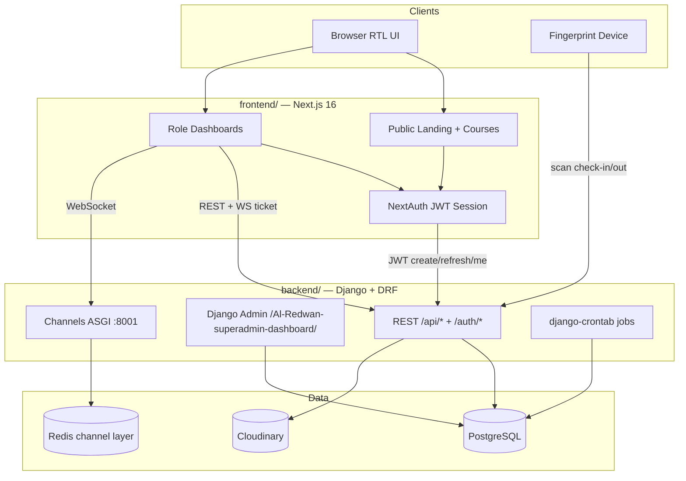

# واحة الرضوان التعليمية (Alredwan Courses Center) — Portfolio Case Study

> Copy-paste ready for personal portfolio / case-study pages.  
> Product brand: **واحة الرضوان التعليمية** · Frontend package: `redwan-oasis`  
> Stack: **Next.js 16 (React 19) + Django REST + PostgreSQL + Redis/Channels**

---

## 1. Project overview

**واحة الرضوان التعليمية** (Alredwan Courses Center / Redwan Oasis) is a full-stack **mosque educational center platform** for managing Quran memorization circles, language courses, and youth activities.

It serves five audiences in one product:

| Audience | What they do |
|----------|----------------|
| **Visitors** | Browse the public landing site, courses, and instructors |
| **Students (طالب)** | Enroll, track progress, attend lectures |
| **Parents (ولي أمر)** | Manage children, request enrollments, follow progress |
| **Instructors (مدرس)** | Run today’s lectures, mark attendance (QR), manage courses |
| **Admins / Supervisors (مدير / مشرف)** | Live fingerprint attendance ops, instructors, schedules, memories |

### Brand identity (from the codebase)

| Token | Value |
|-------|--------|
| **Brand name** | واحة الرضوان التعليمية |
| **Tagline** | علمٌ يُزهر، وإيمانٌ يُثمر |
| **Logo** | `frontend/src/assets/logo.svg` (olive tree / oasis mark) |
| **Display font** | **Medad Platinum** (local TTF — greetings, hero title) |
| **Body font** | **El Messiri** (Google Fonts, Arabic subset) |
| **Primary olive** | `#59695e` (`olive-500`) → `#2e3d38` (`olive-900`) |
| **Accent beige** | `#c9a878` (`beige-500`) |
| **Hero gradient** | `#D2DBC8` → `#557767` |
| **Locale** | `ar` / `ar_EG`, full **RTL**, Africa/Cairo timezone |
| **Locale UX** | Hindi-Indic digits (`٠١٢…`), Arabic plurals (محاضرة / محاضرتان / محاضرات) |

This is **not** a generic e-commerce LMS — it is an operations system for a physical Islamic education center with fingerprint devices, QR ID cards, season-based courses, and parent–child enrollment workflows.

---

## 2. My role — Frontend Developer (React)

**Role:** Frontend Developer (React / Next.js)  
**Surface owned:** Public marketing site + entire role-based Next.js dashboard (`frontend/`)

### Scope I personally built / owned

- **Public marketing experience** — RTL landing (`/`), hero, stats, why-us, courses, instructors, testimonials, WhatsApp CTA; public course catalog (`/courses`, `/courses/[id]`) and instructor profiles (`/instructors/[id]`).
- **Auth UX** — NextAuth credentials flow against Django JWT; login/signup modals and pages; phone-based login (`رقم الهاتف`); role-aware redirects after sign-in.
- **Role-based dashboard shell** — shared header, sidebar, bottom nav, olive gradient content area; nav config per role (`dashboardNavConfig`).
- **Student & parent dashboards** — overview stats, enrollment requests, course cards, parent children management (`/dashboard/my-children`).
- **Instructor workflows** — today’s lectures table, my-courses hierarchy, lecture attendance with **QR scanning** (`@zxing/browser`).
- **Admin / supervisor ops UI** — today’s staff attendances with **live WebSocket** updates, all-attendances filters, instructors leaf-card grid, season schedules, Excel/CSV export.
- **Memories & profile** — tabbed mosque photo feed (`ذكريات المسجد`), profile + change-password forms.
- **Design system in product** — Tailwind v4 tokens, leaf-shaped cards, Medad greetings, shadcn/Radix primitives, DataView tables, Arabic number/date utilities.

### Responsibilities (portfolio framing)

- Translated Arabic product requirements into production React screens with faithful RTL layout.
- Integrated REST + JWT + WebSocket clients; handled session refresh and role gating (`protect`, NextAuth middleware).
- Built operational tools (attendance tables, filters, exports) that staff use daily — not just marketing pages.
- Matched brand typography/color tokens and distinctive leaf-card UI so the product feels specific to واحة الرضوان.

---

## 3. Problem / solution

### Problem

A mosque education center needed to run **seasons of courses**, track **who shows up** (staff via fingerprint + students via lecture QR), let **parents enroll children**, and present a professional public face — without juggling spreadsheets, paper attendance, and disconnected tools.

### Solution

A single platform with:

1. **Public site** for discovery and brand presence.  
2. **Enrollment-request workflow** (pending → processing → accepted/rejected) instead of instant checkout.  
3. **Fingerprint-backed staff attendance** with cron-generated daily records and a live admin board.  
4. **Instructor lecture tools** including QR ID-card scanning for student attendance.  
5. **Parent–child accounts** so guardians manage enrollments and progress.  
6. **Memories feed** for community photos (Cloudinary), plus season/course admin surfaces.

---

## 4. High-level architecture

### Apps & services

| Layer | Technology | Responsibility |
|-------|------------|----------------|
| **Frontend** | Next.js 16 App Router, React 19, Tailwind 4 | Public site + dashboards |
| **API** | Django 5.2 + DRF + Djoser/SimpleJWT | Domain API, auth, admin |
| **Realtime** | Django Channels + Redis | Live staff attendance (`ws/attendance/`) |
| **DB** | PostgreSQL 17 | System of record |
| **Media** | Cloudinary | Course/instructor/memory assets |
| **Ops** | Docker Compose | `redwan-db`, `redis`, `redwan-backend` (:8000 HTTP / :8001 WS), `redwan-frontend` (:3000) |
| **Devices** | Fingerprint scanners | `POST /api/attendance/scan/` (device auth, no JWT) |

### Diagram



### Backend Django apps

`users` · `parents` · `courses` · `enrollments_payments` · `attendance` · `memories` · `core`

### API prefixes (high level)

| Prefix | Domain |
|--------|--------|
| `/auth/` | Djoser + JWT (phone login) |
| `/api/courses/` | Seasons, courses, lectures, exams |
| `/api/users/` | Instructors, landing, ratings |
| `/api/attendance/` | Devices, scans, staff attendance, WS tickets |
| `/api/` | Enrollment requests, enrollments, payments |
| `/api/parents/` | Children CRUD |
| `/api/memories/` | Feeds + Cloudinary signed upload |
| `/health/` | Health check |

---

## 5. Full feature breakdown (major modules / screens)

### 5.1 Public marketing & discovery

| Route | Feature | What it does |
|-------|---------|----------------|
| `/` | Landing page | Full brand story: hero (Medad title + tagline + CTAs), stats (إنجازتنا بالأرقام), why-us (لماذا واحة الرضوان؟), instructors, goals, activities, featured courses, testimonials, contact CTA, WhatsApp widget |
| `/courses` | Public course catalog | Searchable/filterable **leaf cards** — name, description, tags, start date, lecture count, capacity, price (جنيه), CTAs «عرض الدورة» / «سجل الآن» |
| `/courses/[id]` | Course detail | Hero image, meta, ratings, enroll entry point |
| `/instructors/[id]` | Instructor profile | Public instructor bio + ratings |
| `/about`, `/activities`, `/contact-us` | Content stubs | Landing anchors; pages exist as «coming soon» style placeholders in current build |
| Nav / Footer / MobileNav | Chrome | Sticky translucent nav; mobile bottom bar (الرئيسية، الدورات، عن الواحة، الأنشطة، تسجيل الدخول / لوحة التحكم) |

### 5.2 Authentication

| Route / UI | Feature | What it does |
|------------|---------|----------------|
| `/?login=true` / AuthModal | Primary login UX | Logo, welcome copy «أهلاً بك في واحة الرضوان التعليمية», phone (+2 country code) + password |
| `/login`, `/signup` | Dedicated auth pages | Student/parent signup (name, DOB, gender, role طالب/ولي أمر) |
| `/forgot-password` | Password recovery | Centered card flow |
| NextAuth + Django JWT | Session | Credentials → `/auth/jwt/create/` + `/auth/users/me/`; refresh; instructor also resolves `instructor_id` |

### 5.3 Shared dashboard shell

| Piece | What it does |
|-------|----------------|
| `/dashboard` | Role redirect hub (admin → today’s staff attendance; instructor → today’s schedule; parent/student → overview) |
| Header | Logout, avatar + name («أخ {name}» for instructors), notifications drawer («+1 إشعار» / إشعارات اليوم), logo, decorative SVGs |
| Sidebar / bottom nav | Role-specific Arabic labels from `dashboardNavConfig` |
| Content area | Olive wash gradient; Medad greetings (`dashboard-greeting`) |

### 5.4 Student module

| Route | Feature | What it does |
|-------|---------|----------------|
| `/dashboard/overview` | Student overview | Greeting «السلام عليكم يا {name}»; stats: الدورات النشطة، الطلبات المعلقة، معدل الحضور; recent enrolled courses; enrollment request list |
| `/dashboard/my-courses` (+ nested) | دوراتي | Student’s active courses; course detail; lectures; progress-oriented course cards |
| `/dashboard/courses` | جميع الدورات | Browse/enroll catalog inside dashboard (same card language as public) |
| `/dashboard/courses/[courseId]` | Course + purchase/enroll modal | Submit enrollment request for self |
| `/dashboard/memories` | ذكريات المسجد | Public + private memory tabs |
| `/dashboard/profile` (+ `/edit`) | الملف الشخصي | Avatar, basic data (phone, email, DOB, address), change password |

### 5.5 Parent module

| Route | Feature | What it does |
|-------|---------|----------------|
| `/dashboard/overview` | Parent overview | Stats: عدد الأطفال، الطلبات المعلقة، إجمالي المدفوعات; child cards; recent requests |
| `/dashboard/my-children` | إدارة الأطفال | Add/list children; empty states; codes; age display |
| `/dashboard/my-children/[childId]` | Child overview | Reuses student-style overview for a selected child |
| `/dashboard/my-children/[childId]/courses` | Child courses | Courses tied to that child |
| `/dashboard/courses` | Enroll for children | Enrollment requests must specify which child |

### 5.6 Instructor module

| Route | Feature | What it does |
|-------|---------|----------------|
| `/dashboard/todays-schedule` | محاضرات اليوم | Table: م، المحاضرة، الدورة، البداية، النهاية، الحالة (تم التسجيل / غير مسجلة); search/sort/filter; Excel export |
| `/dashboard/my-courses` | Instructor courses | Table of assigned courses (season, start/end) |
| `/dashboard/my-courses/[courseId]` | Course details | Editable course form for instructor ownership |
| `…/lectures` | Lectures list | Lecture statuses + ratings surfaces |
| `…/lectures/[lectureId]` | Lecture attendance | Student list, times, notes, **QR scanner** for ID cards |
| `…/enrollments` | الحجوزات | Course enrollment table for that course |

### 5.7 Admin / supervisor module

| Route | Feature | What it does |
|-------|---------|----------------|
| `/dashboard/todays-staff-attendances` | حضور اليوم | Live board: staff name, target (محاضرة/إشراف), scheduled vs actual times, status badges (حاضر/غائب/متأخر/لم يبدأ), manual check-in/out/absent, rating, **WebSocket** live updates, generate records, CSV export |
| `/dashboard/all-attendances` | جميع الحضور | Historical attendance log with richer date/status filters |
| `/dashboard/instructors` | قائمة المعلمين | Leaf-card grid of instructors + «عرض الملف الشخصي» |
| `/dashboard/instructors/[id]` | Instructor detail | Profile + timetable context |
| `/dashboard/season-schedules` | الجداول | Season weekly schedule management + CSV export (**admin** nav) |
| Django Admin | `/Al-Redwan-superadmin-dashboard/` | Full CRUD, Excel export mixin across models; enrollment approval currently admin-panel driven |

### 5.8 Domain subsystems (backend-backed features surfaced in UI)

| Subsystem | Behavior |
|-----------|----------|
| **Seasons** | Courses belong to a season (school / summer camp, etc.); filtering often season-aware |
| **Course schedules → lectures** | Weekly slots; cron generates individual `Lecture` sessions (`pending` / `submitted`) |
| **Enrollment requests** | PENDING → PROCESSING → ACCEPTED (creates Enrollment + optional Payment) or REJECTED / CANCELLED; expiry rules |
| **Staff fingerprint attendance** | Cron pre-generates daily `lecture` + `supervision` records; device scan check-in/out; grace → present/late; cron marks absent |
| **Student lecture attendance** | Instructor records within policy window; QR ID cards (backend generates PNG/PDF with `qrcode` + ReportLab) |
| **Ratings** | Student/parent ratings for courses and instructors |
| **Memories** | Cloudinary images/videos; general vs private feeds; supervisor upload |
| **Payments (model)** | Methods: نقدًا، بطاقة، تحويل بنكي، إنستاباي، فودافون كاش |

---

## 6. Surfaces (multi-app layout)

This repo is **one product, multiple surfaces** (not separate deployable “hospital vs admin” apps):

| Surface | Location | Audience |
|---------|----------|----------|
| **Public Next.js site** | `frontend/src/app/(public)/` | Visitors / guests |
| **Next.js role dashboards** | `frontend/src/app/dashboard/` | Student, parent, instructor, supervisor, admin |
| **Django Admin** | Backend `/Al-Redwan-superadmin-dashboard/` | Superusers / ops back-office |
| **Device API** | `/api/attendance/scan/` etc. | Physical fingerprint hardware |

Supervisor is a **type of instructor** (`Instructor.type`) with extra supervision schedules and a reduced admin-like Next nav (حضور اليوم، جميع الحضور، المعلمون، ذكريات المسجد — without الجداول / جميع الدورات in nav config).

---

## 7. Auth, RBAC, and modes

### Roles

`student` | `parent` | `instructor` | `supervisor` | `admin`  
(Arabic: طالب، ولي أمر، مدرس، مشرف، مدير)

Login identifier: **phone number** (`phone_number1`, E.164 via `phonenumbers`).

### Dual modes worth calling out

1. **Public vs authenticated** — marketing site vs `/dashboard/*`.  
2. **Normal instructor vs supervisor** — lecture-tied attendance vs additional `supervision` shifts from `SupervisorSchedule`.  
3. **Parent vs student enrollment** — parent must bind a child; student enrolls self.  
4. **Staff fingerprint vs student QR** — two attendance capture modes for different actors.

### Frontend gating

| Layer | Behavior |
|-------|----------|
| NextAuth `withAuth` (`proxy.ts`) | All `/dashboard/:path*` require session; else `/?login=true` |
| Role redirect on `/dashboard` | admin → `todays-staff-attendances`; instructor → `todays-schedule`; parent/student → `overview` |
| `protect(allowedRoles)` | Server helper on overview, courses, my-children, my-courses, todays-schedule, profile edit |
| Nav config | Hides irrelevant links per role |

### Backend permission examples

- `IsAdminOrCourseInstructor` / supervisor-aware course access  
- `IsParent`, `IsChildPrimaryParent`, `IsParentOrAdmin`  
- `IsParentOrStudent`, `IsOwnerOrAdminOrSupervisor` (enrollments)  
- Memories: `IsSupervisor`, uploader time-window rules  
- Staff WebSocket: staff-only consumers + short-lived `WebSocketTicket`

---

## 8. Tech stack tables

### Frontend (`frontend/` — `redwan-oasis`)

| Area | Stack |
|------|--------|
| Framework | Next.js **16.1.5** (App Router), React **19**, TypeScript |
| Auth | NextAuth v4 (JWT strategy → Django) |
| Styling | Tailwind CSS **v4**, CSS `@theme` tokens, shadcn/Radix |
| UI extras | MUI date pickers, Motion, Swiper, Lucide, react-hot-toast |
| Data UI | TanStack Table, custom DataView |
| Forms | react-hook-form |
| Realtime | react-use-websocket |
| QR | `@zxing/browser` |
| Export | `xlsx` (SheetJS) |
| HTTP | Axios + server actions under `frontend/src/actions/` |

### Backend (`backend/`)

| Area | Stack |
|------|--------|
| Runtime | Python, Django **5.2**, DRF |
| Auth | Djoser + SimpleJWT (`Authorization: JWT …`) |
| Realtime | Channels + Redis + Daphne/Uvicorn (:8001) |
| DB | PostgreSQL 17 (`psycopg2`) |
| Media | Cloudinary + django-cloudinary-storage |
| Jobs | django-crontab |
| Export | openpyxl Excel mixin (admin) |
| ID cards | qrcode, Pillow, ReportLab, arabic_reshaper, python-bidi |
| Phone | phonenumbers |
| Deploy | Docker Compose, Gunicorn/Uvicorn, WhiteNoise |

### Infra

| Service | Role |
|---------|------|
| `redwan-db` | Postgres |
| `redis` | Channel layer |
| `redwan-backend` | API :8000 + WS :8001 |
| `redwan-frontend` | Next :3000 |

---

## 9. Cross-cutting features

| Feature | Implementation |
|---------|----------------|
| **RTL / Arabic-first UI** | `lang="ar"` `dir="rtl"`; hardcoded Arabic copy; `toHindiDigits`, `getArabicPlural`, `ar-EG` date/time |
| **i18n package** | None (no next-intl) — single-locale Arabic product |
| **WebSockets** | `ws/attendance/` — live staff attendance board for admins |
| **Excel / CSV export** | Frontend: today’s lectures XLSX, attendances/schedules CSV; Backend admin: ExcelExportMixin |
| **QR scanning** | Instructor lecture page scans student/child ID cards |
| **QR ID card generation** | Backend PNG/PDF cards for students & children |
| **Fingerprint devices** | Scan/check-in/check-out APIs; `AttendanceDevice`, `fingerprint_id` |
| **Cloudinary** | Media storage + memories signed upload |
| **Cron automation** | Generate daily attendances; mark absent; lecture generation from schedules |
| **WhatsApp** | Landing WhatsApp widget + user WhatsApp field |
| **Notifications UI** | In-app drawer shell («إشعارات اليوم») — **not FCM/push** |
| **Maps / chat / FCM** | **Not present** in this codebase |
| **Ratings** | Course & instructor ratings from students/parents |
| **Payments model** | Cash, card, bank transfer, Instapay, Vodafone Cash enums |

---

## 10. Feature checklist

### Public

- [x] RTL landing with brand hero, stats, why-us, courses, instructors, testimonials
- [x] Public course catalog + detail
- [x] Public instructor profile
- [x] Auth modal / login / signup / forgot password
- [x] WhatsApp contact widget
- [ ] Full about / activities / contact content pages (stubs today)

### Student

- [x] Overview with stats + recent courses + enrollment requests
- [x] My courses + nested course/lecture views
- [x] Browse all courses + enrollment request
- [x] Memories (general + private)
- [x] Profile + edit + change password

### Parent

- [x] Overview with children + payments summary
- [x] My children management
- [x] Child overview / courses
- [x] Enroll children via enrollment requests
- [x] Memories + profile

### Instructor

- [x] Today’s lectures table + Excel export
- [x] My courses list + course detail
- [x] Lectures list + lecture attendance (QR)
- [x] Course enrollments view
- [x] Memories + profile

### Admin / Supervisor

- [x] Today’s staff attendances (live WS)
- [x] All attendances history
- [x] Instructors directory + detail
- [x] Season schedules (admin nav)
- [x] Manual attendance actions + rating
- [x] Generate attendance records
- [x] CSV export from ops views
- [x] Django Admin Excel export across models
- [ ] In-dashboard enrollment approve/reject UI (currently Django Admin)

### Platform

- [x] Phone JWT auth + NextAuth session
- [x] Role-based nav + redirects
- [x] Fingerprint device integration APIs
- [x] Cloudinary media
- [x] Docker Compose multi-service local/prod-shaped stack
- [ ] Push notifications (FCM)
- [ ] Multi-language toggle (product is Arabic-only by design)

---

## 11. UX & design notes (real brand patterns)

- **Brand-first hero** — Medad display title «واحة الرضوان التعليمية» over olive gradient + `hero-bg.svg`; CTAs use asymmetric radii (`rounded-[1.8rem_0]` primary / reverted secondary).
- **Leaf cards** — Signature UI: large one-sided radius (`rounded-[0_13.8rem]` / even index flipped) for courses, instructors, children — not generic rounded rectangles.
- **Dashboard greetings** — Medad olive greetings: «السلام عليكم يا {name}», instructors «يا أخ {name}», admin attendance hardcodes «يا شيخ بنداري».
- **Stat strip** — Soft inner-shadow gradient bar for KPIs (courses, pending requests, attendance %).
- **Ops density** — Admin attendance is a dense table with time badges (bonus olive / penalty `#9F2E2E` / neutral gray) and filter chips — built for staff desks, not marketing.
- **Typography system** — Medad for ceremony; El Messiri for UI body; rem root scaled (`62.5%`) with responsive steps.
- **Color system** — Olive scale + beige accent in headings («واحة» highlighted beige in why-us); avoid inventing purple/saas gradients — stay on tokens from `globals.css`.
- **Motion** — Landing uses ScrollReveal / Motion; Swiper for carousels.
- **Empty states** — Arabic guidance + CTA to browse courses or add a child — never silent blank screens.

---

## 12. Challenges & what I learned

1. **RTL as a first-class constraint** — Layout, absolute nav centering, leaf-card mirroring, and table alignment all had to be designed RTL-native, not LTR-flipped as an afterthought.  
2. **Role explosion without five separate apps** — One dashboard shell + nav config + selective `protect()` kept the codebase coherent while serving five personas.  
3. **Realtime ops UI** — Wiring WebSocket tickets + live attendance rows taught me to treat admin boards as event-driven systems, not CRUD pages.  
4. **Physical-world integrations** — Fingerprint devices and QR ID cards forced clear separation between browser JWT auth and device/scan endpoints.  
5. **Enrollment as workflow, not cart checkout** — Pending/processing states, parent–child binding, and season capacity rules required careful empty states and request lists.  
6. **Brand fidelity under Tailwind v4** — Moving design tokens into `@theme` CSS and custom utilities (`dashboard-greeting`, leaf shapes) kept the UI unmistakably واحة الرضوان.

---

## 13. Impact (placeholders — fill with real metrics)

- Supported **[X]** concurrent seasonal courses across **[Y]** active seasons.  
- Enabled **[N]** instructors/supervisors to check in via fingerprint with live admin visibility.  
- Reduced paper attendance overhead for **[N]** weekly lectures using QR student check-in.  
- Gave **[P]** parents a single place to manage **[C]** children enrollments and payments visibility.  
- Delivered a public brand site that presents واحة الرضوان with production Arabic RTL UX.  
- Centralized ops exports (CSV/XLSX) for **[D]** daily attendance reviews.

---

## 14. Copy-paste blurbs

### Short (2–3 sentences)

I built the React/Next.js frontend for **واحة الرضوان التعليمية**, an Arabic RTL platform for a mosque courses center. The product covers a public marketing site plus role-based dashboards for students, parents, instructors, and admins — including live fingerprint attendance, QR lecture check-in, and season-based enrollment workflows. I owned the UI system (olive/Medad brand), NextAuth–JWT integration, and the operational tables staff use day to day.

### Medium case study

**واحة الرضوان التعليمية** needed more than a brochure site: seasons, enrollments, parent–child accounts, and reliable attendance for both staff and students. As Frontend Developer (React), I implemented the Next.js 16 App Router client against a Django REST API — public course discovery, phone-based auth, and five role experiences in one dashboard shell. Highlights include the admin **حضور اليوم** board (WebSocket live updates), instructor **محاضرات اليوم** with Excel export and QR scanning, and parent **أطفالي** management. The UI is deliberately brand-specific: Medad + El Messiri, olive/beige tokens, and signature leaf cards, all RTL-first.

### Long narrative

Educational centers like واحة الرضوان run on schedules, trust, and presence. Families enroll children into Quran and skills courses; instructors teach timed lectures; supervisors cover shifts; admins need to know who arrived on time. Spreadsheets and paper cards do not scale.

I joined as the Frontend Developer responsible for the React experience. On the public side, I shipped a full Arabic landing and course catalog that lead with the oasis brand — Medad headlines, olive gradients, and clear CTAs into auth. On the authenticated side, I built the dashboard shell and persona-specific flows: students tracking courses and enrollment requests; parents managing children and payments summaries; instructors running today’s lectures and marking attendance with QR-scanned ID cards; admins watching fingerprint-backed staff attendance update live over WebSockets.

Technically, the frontend sits on Next.js 16, React 19, Tailwind v4 design tokens, NextAuth against Django JWT, TanStack-powered tables, and SheetJS exports. The harder problems were product problems: encoding Arabic RTL correctly, expressing enrollment as a request workflow rather than a cart, and making operational UIs fast enough for desk staff without abandoning the brand language. The result is a cohesive platform where marketing, family self-service, and center operations share one visual and technical system.

---

## 15. Portfolio tags

`Next.js` · `React` · `TypeScript` · `Tailwind CSS` · `App Router` · `NextAuth` · `JWT` · `RTL` · `Arabic UI` · `Django REST` · `WebSockets` · `PostgreSQL` · `Cloudinary` · `QR Code` · `Fingerprint Attendance` · `Role-Based Access` · `EdTech` · `Dashboard Design` · `Design Systems` · `Excel Export` · `Docker`

---

## 16. Suggested screenshots mapping (`preview-shots/`)

Open HTML files locally at **1280×720**, screenshot, then map to portfolio sections:

| File | Use in portfolio |
|------|------------------|
| `preview.html` (root) | Hero / cover image |
| `01-homepage-showcase.html` | Marketing — product shot |
| `02-public-home.html` | Public homepage (real UI) |
| `03-courses-capability.html` | Capability — course cards |
| `04-public-courses.html` | Public catalog |
| `05-dashboard-workflow.html` | Marketing — dashboard mood |
| `06-brand-splash-a.html` | Brand / logo slide |
| `07-student-overview.html` | Student dashboard |
| `08-parent-overview.html` | Parent dashboard |
| `09-parent-children.html` | Parent — أطفالي |
| `10-instructor-schedule.html` | Instructor — محاضرات اليوم |
| `11-brand-splash-b.html` | Alternate brand splash |
| `12-instructor-my-courses.html` | Instructor courses |
| `13-admin-attendances.html` | Admin live attendance (flagship ops) |
| `14-admin-instructors.html` | Admin instructors grid |
| `15-memories.html` | Memories feed |
| `16-profile.html` | Profile |
| `17-login.html` | Auth modal |
| `18-student-my-courses.html` | Student my courses |
| `19-public-course-detail.html` | Course detail |
| `20-dashboard-courses.html` | In-dashboard course browse |

**Suggested case-study sequence:** cover (`preview` / `06`) → home (`02`) → courses (`04`) → student (`07`) → parent (`08`/`09`) → instructor (`10`) → admin attendance (`13`) → brand close (`11`).

---

## 17. Repo structure

```
alredwan-courses-center/
├── frontend/                 # Next.js 16 app (redwan-oasis)
│   ├── src/app/              # App Router: (public)/ + dashboard/
│   ├── src/components/       # Landing, dashboard, UI, icons
│   ├── src/actions/          # Server actions (API bridge)
│   ├── src/assets/           # Logo, hero, avatars, image-grid
│   ├── src/lib/              # Utils (Hindi digits, export, cn)
│   ├── ONBOARDING.md         # Frontend domain + feature guide
│   └── package.json
├── backend/                  # Django 5.2 + DRF
│   ├── Redwan_courses_center/  # Settings, root URLs
│   ├── users/ parents/ courses/
│   ├── enrollments_payments/ attendance/ memories/ core/
│   ├── docs_v2/              # API source of truth
│   └── requirements.txt
├── docker-compose.yml        # db + redis + backend + frontend
├── preview.html              # Marketing preview canvas
├── preview-shots/            # Static 1280×720 screenshot HTML
├── package.json              # Root helper (xlsx)
├── README.md                 # Branch naming conventions
└── PORTFOLIO.md              # This document
```

---

*Generated from the repository as implemented — routes, roles, tokens, and integrations reflect the codebase, not aspirational roadmap items unless marked unchecked above.*
