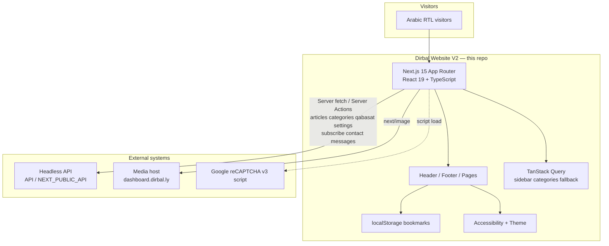

# PORTFOLIO.md — موقع د. عياد دربال (Dirbal Website V2)

> Copy-ready case study material for a personal portfolio.  
> Project package: `new-dirbal-website-v2` · Stack: Next.js 15 App Router · React 19 · TypeScript · Tailwind CSS v4

---

## 1. Project overview

**موقع د. عياد دربال (Dirbal)** is a public Arabic content website for judicial, legal, and cultural writing. It publishes curated articles (مدونات), rotating scholarly quotes (قبسات), category-based browsing across judicial branches, full-text search, tags, bookmarks, and a biography page — all in a premium RTL reading experience.

| | |
|---|---|
| **Product name** | موقع د. عياد دربال / دربال (Dirbal) |
| **Tagline** | مدونة قضائية، قانونية، ثقافية |
| **Audience** | Judges, lawyers, law students, and readers of Libyan judicial / legal content |
| **Product type** | Headless public website (frontend only in this repo) |
| **CMS / API** | External headless backend; media served from `dashboard.dirbal.ly` |
| **Primary language** | Arabic only (`lang="ar"`, `dir="rtl"`) |

### Brand identity (from the codebase)

| Token | Value |
|-------|--------|
| **Brand / logo name** | دربال — assets: `LogoShortWht.png`, `logoWht.png`, `LogoShortBlkV2.png`, `Basmala.png`, `DirbalLogo.svg` |
| **Primary accent** | `#B5975C` (gold — CTAs, borders, headings, nav line) |
| **Gold variants** | `#C18F59`, `#A08750`, `#9d7f45`, `#B4935C`, `#AB8219` (footer border), `#775C1C` (section hairlines) |
| **Light page background** | `#f3f3f3` |
| **Dark theme background** | `#0f172a` |
| **Footer base** | `#050A12` / copyright bar `#070D17` |
| **Primary font** | **Tajawal** (Google Font via `next/font`, weights 200–900, Arabic + Latin) |
| **Secondary font files on disk** | Zahra Arabic OTF, Majalla TTF under `public/fonts/` (not primary UI) |
| **Signature UI motifs** | Centered Basmala in the navbar, gold hairline under header, section logos with `#775C1C` rules, glass-style قبسات card on dark hero overlays |

---

## 2. My role — Frontend Developer (React)

**Role:** Frontend Developer (React / Next.js)  
**Ownership:** End-to-end public website frontend for Dirbal V2 — architecture, UI implementation, data integration, SEO surface, and accessibility UX.

### Scope I owned

- Designed and implemented the **Next.js 15 App Router** public site (`src/app/(homePage)/…`) as a single RTL Arabic product.
- Built the full **reading and discovery UX**: homepage hero carousel + قبسات, curated mokhtarat, recent topics, dynamic category/subcategory listings, article detail with media actions, search, tags, archive, and resume.
- Integrated the **headless API** (`API` / `NEXT_PUBLIC_API`) for articles, categories, qabasat, settings images, subscribe, contact, and comments — including resilient homepage aggregation via `Promise.allSettled`.
- Implemented **client-side bookmarks** (`localStorage` + cross-tab events) and the `/archive` favorites experience without requiring login.
- Delivered **SEO foundations**: per-route metadata generators, Open Graph / Twitter cards, and JSON-LD structured data (Organization, WebSite + SearchAction, Article, CollectionPage, breadcrumbs).
- Built **accessibility controls** (font scale, light/dark theme via `next-themes`, reset-on-navigate) and polish patterns (skip link, scroll-to-top, loading UI per route).
- Established the **design system in code**: Tajawal, gold `#B5975C` accents, shadcn-style Radix primitives (dialog/sheet), Embla carousel, Motion animations, and shared layout chrome (Header / Footer).

### Responsibilities (portfolio-ready bullets)

- Translated a judicial content brand into a production RTL interface that feels editorial, not generic SaaS.
- Owned routing, server components, client islands, and `force-dynamic` data fetching strategy.
- Built reusable article cards, pagination, in-page search highlighting, audio player, PDF download, and social share flows.
- Wired footer newsletter, contact, and article comment forms to server actions.
- Configured Next image optimization for `dashboard.dirbal.ly`, standalone Docker-friendly output, and Turbopack-based local development.
- Documented accessibility behavior and produced static `preview-shots/` HTML for portfolio screenshots.

---

## 3. Problem / solution

### Problem

Legal and judicial writing for a Libyan audience needed a **serious, readable Arabic web presence** — not a blog template. Content is hierarchical (category → subcategory → optional sub-subcategory tabs → article), media-rich (audio, PDF, images), and discovery-heavy (search, tags, curated picks, recent uploads). The CMS already lived on a separate dashboard; the public site had to be a **fast, SEO-capable headless frontend** with strong brand identity (gold + Basmala + Tajawal) and offline-friendly personal bookmarks.

### Solution

Ship **Dirbal Website V2** as a Next.js App Router frontend that:

1. Consumes the existing API for all editorial content and site settings images.
2. Presents a distinctive RTL homepage (قبسات carousel + مدونات منتقاة + أحدث المدونات).
3. Supports deep browsing via `/[categoryname]/[subCategory]` with tabs, pagination, and in-list search highlighting.
4. Turns each article into a full reading workspace (body, tags, related topics, audio/PDF, share, comments, bookmark).
5. Adds visitor tools that do not require accounts: search, tags, local favorites archive, accessibility panel.
6. Layers metadata + JSON-LD so articles and listings are discoverable.

---

## 4. High-level architecture

This repository contains **one public web app**. The CMS/admin lives outside the repo at `dashboard.dirbal.ly` and is treated as an external API + media host.



### Data flow (simplified)

| Layer | Responsibility |
|-------|----------------|
| **Server Components / `lib/api/*`** | Primary data path — `fetch` with `cache: "no-store"`, pages marked `force-dynamic` |
| **Server Actions** (`lib/actions/*`) | `subscribe`, `sendContact`, `sendMessage` (comments) |
| **TanStack Query** | Secondary: category list in mobile sidebar if server props empty |
| **localStorage** | Bookmarks (`bookmarked_articles`), optional comment form identity |
| **Settings API** | Footer images, home background, favourite-section background, about-me HTML |

---

## 5. Full feature breakdown (every major module / screen)

### 5.1 Global shell — Header (`Navbar` + Sidebar + Search modal)

**Routes affected:** all pages under `(homePage)` layout.

- Absolute navbar with **Dirbal short white logo**, centered **Basmala** (on applicable slides/pages), and gold hairline (`#B5975C`) under the bar (hidden on search/tags/archive/resume).
- **Archive button** with live bookmark count badge; navigates to `/archive`; listens to `bookmarks-changed` and `storage` events.
- **Search entry** opens a modal to start site search.
- **Hamburger sidebar** (Radix sheet from the right): logo, link to الرئيسة, accordion of categories/subcategories from API (React Query fallback), decorative `Sidebarsurah.png`.

### 5.2 Global shell — Footer

Three columns on dark `#050A12` with `#AB8219` top border and CMS background image:

| Column | Feature |
|--------|---------|
| **First** | White logo (`logoWht.png`), about blurb, CTA **المزيد** → `/resume` |
| **Second** | Share site (Facebook, Messenger, X, WhatsApp, Viber), newsletter subscribe (`POST /subscribe`), QR code asset |
| **Third** | Contact form **تواصل** (`POST /contact`) |

Copyright bar: `© دربال، جميع الحقوق محفوظة ضد الاستعمال التجاري، 2025`.

### 5.3 Homepage — `/`

Orchestrated by `home-page.tsx` with skip link **انتقل إلى المحتوى الرئيسي**.

#### Hero / قبسات carousel (`hero-section`)

- Embla carousel: **MainSlide** (قبسات) + **DynamicSlide** per category.
- Dark overlay `rgba(37,37,37,0.9)` over CMS home background; Basmala; **Aya.png** + glass **QabasatBox** (category label, dots, quote, source).
- Category slides: large title, description, subcategory chips/links with icons.
- Nav arrows for slide control.

#### Mokhtarat — مدونات منتقاة (`mokhtarat`)

- Section logo + heading **مدونات منتقاة / من مختلف الفروع**.
- Curated “best” articles from `/articles/best`.
- Highlight cards with subcategory icon, gold number/short prefix, body preview, **المزيد** CTA.
- Alternating gold-tint row bands.

#### Recent topics — أحدث المدونات المرفوعة (`resnet-topics`)

- Full-bleed favourite-article background + dark overlay.
- Split layout: detailed left panel + paginated right list cards with date badges.
- Share / bookmark / copy actions on the featured item.
- Empty state: **لا توجد مقالات متاحة حالياً**.

### 5.4 Category listing — `/[categoryname]/[subCategory]`

- Hero band with subcategory image, title, breadcrumb (Home → subcategory), description.
- Body over `mainbg-10.png`: desktop sidebar with **ابحث في هذه الصفحة** + vertical **active tabs** for sub-subcategories; mobile tab strip.
- Article cards (expandable previews), metadata (date + author icons), gold dividers.
- **In-page search highlighting** (`search-highlight` / yellow marks) and empty states (**لم يتم العثور على نتائج**, **عذراً** branch empty).
- Full pagination (first / prev / numbers / next / last + jump).

### 5.5 Article detail — `/[categoryname]/[subCategory]/[articleId]`

Full reading workspace:

| Area | Behavior |
|------|----------|
| **Heading** | Subcategory hero image, book badge (`bgbooks.jpg`) with `title_number` / `title_short`, gold title, breadcrumbs |
| **Body (`mawdooa`)** | Numbered title, date/author meta, subtitle, gold HR, description, HTML body, subjects, tags → `/tags?tag=` |
| **Audio** | Custom player when `voice_url` exists (play/pause/seek/download) |
| **In-article search** | Chip **البحث:** + jump to first highlight |
| **Action sidebar** | Bookmark, share (FB / Messenger / X / WhatsApp / Telegram / copy), PDF via `document_url`, jump to comments |
| **Related column** | Local search + **آخر موضوعات الفرع** list with date thumbs |
| **Comments** | **أضف تعليقاً** form → `POST /messages` with optional `article_uuid`; remember-me via `localStorage` |

### 5.6 Search — `/search?q=&page=`

- Section logo `sectionLogo-5.svg`, heading **نتائج البحث**.
- Query line **البحث عن: "…"**; empty prompt **أدخل كلمة البحث للبدء**.
- Server search via `/articles/search`, ~15 per page, yellow term highlights, shared article cards + pagination.

### 5.7 Tags — `/tags?tag=&page=`

- Same chrome pattern as search; heading **المقالات حسب المفتاحيات**.
- Tag line **المفتاح: "…"**; API `/articles/by-tag/:tag`.
- Empty states for missing tag or no results.

### 5.8 Archive / Favorites — `/archive`

- Client page listing bookmarks from `localStorage` key `bookmarked_articles`.
- Heading **المفضلة**; empty copy **المفضلة خالية** / **لم تضف من عندك أي موضوع بعد** (`#FAE1C6`).
- Remove via trash control; no server account required.

### 5.9 Resume / Biography — `/resume`

- Centered **السيرة الذاتية** with gold flanking HRs.
- HTML body from `/settings/about-me`.
- Linked from footer “المزيد”.

### 5.10 Catch-all / test routes

- `src/app/[...rest]/page.tsx` → `notFound()` (hard 404).
- `.../test/test/test/[subCategory]/[articleId]` — duplicate article route for development; not a product feature.

### 5.11 Accessibility & global UX

- Floating accessibility control: **A+ / A−** font scale (≈50%–200%), light/dark theme toggle (`data-theme`), reset; scale resets on navigation.
- Scroll-to-top button (appears after ~300px).
- Per-route `loading.tsx` skeletons for search, tags, archive, resume, category.

---

## 6. Multiple apps

**Not applicable as separate deployable apps in this repository.**

| Surface | Location | Notes |
|---------|----------|--------|
| **Public website (this repo)** | `new-dirbal-website-v2` | Only application implemented here |
| **CMS / Dashboard** | External (`dashboard.dirbal.ly`) | Image domain + implied content API host — **not in this codebase** |
| **Admin / staff tools** | — | None |
| **Mobile apps** | — | None |

Treat portfolio framing as: **one public headless frontend** integrated with an external content dashboard.

---

## 7. Auth, RBAC / permissions, dual modes

| Topic | Status in this codebase |
|-------|-------------------------|
| **Login / signup** | Not implemented |
| **Sessions / middleware** | No `middleware.ts`; no protected routes |
| **next-auth** | **Not installed**. Leftover files only: `src/lib/constants/auth.constant.ts`, `src/lib/types/next-auth.d.ts` |
| **RBAC / roles / permissions** | None |
| **Dual modes** | **Light / dark theme** via `next-themes` (`data-theme="light"|"dark"`), controlled from the accessibility panel — visitor preference, not auth roles |
| **Personalization without auth** | Bookmarks + optional saved comment name/email in `localStorage` |

**Portfolio framing:** intentional public-read site; identity and content management stay on the external dashboard. The frontend focuses on anonymous discovery, reading, and local favorites.

---

## 8. Tech stack table

### Public website (`new-dirbal-website-v2`)

| Layer | Technology | Version / notes |
|-------|------------|-----------------|
| Framework | Next.js (App Router) | `^15.5.9` · Turbopack in `dev` · `output: "standalone"` |
| UI library | React | `^19.2.3` |
| Language | TypeScript | `^5` · `strict` |
| Styling | Tailwind CSS | `^4` + `@tailwindcss/postcss` + `tw-animate-css` |
| Components | Radix Dialog / Sheet patterns | `@radix-ui/react-dialog` · shadcn-style `new-york` |
| Icons | Lucide + react-icons | `lucide-react`, `react-icons` |
| Carousel | Embla | `embla-carousel-react` |
| Animation | Motion | `motion` `^12` |
| Server/async UI state | TanStack Query | `^5.84.2` (limited client use) |
| Theming | next-themes | light/dark via `data-theme` |
| Forms / bot script | react-google-recaptcha + v3 script | Site key via `NEXT_PUBLIC_RECAPTCHA_SITE_KEY` |
| Fonts | Tajawal (`next/font/google`) | Arabic + Latin subsets |
| Image CDN allowlist | `dashboard.dirbal.ly` | webp/avif formats |
| Lint | ESLint + `eslint-config-next` | |

### External systems (not in repo)

| System | Role |
|--------|------|
| Headless API (`API` / `NEXT_PUBLIC_API`) | Articles, categories, qabasat, settings, subscribe, contact, messages |
| `dashboard.dirbal.ly` | CMS media / dashboard host (Next `images.domains`) |

### Environment variables used in code

| Variable | Purpose |
|----------|---------|
| `API` | Server-side API base URL |
| `NEXT_PUBLIC_API` | Client-side API base URL |
| `NEXT_PUBLIC_RECAPTCHA_SITE_KEY` | reCAPTCHA v3 |

---

## 9. Cross-cutting features

| Capability | Implementation |
|------------|----------------|
| **RTL / Arabic i18n** | Root `lang="ar"` `dir="rtl"`; Tajawal; Arabic UI copy site-wide. No `next-intl` runtime; metadata mentions `/en` alternates but **no English routes ship**. |
| **SEO metadata** | `src/lib/metadata/data.ts` — per-page generators (home, subcategory, article, search, tags, archive) |
| **JSON-LD structured data** | `src/lib/Seo/data.ts` — Organization, WebSite + SearchAction, Article, CollectionPage, breadcrumbs |
| **Search highlighting** | Yellow `<mark>` / `.search-highlight` in listings and article body |
| **Bookmarks** | `localStorage` + custom events; header badge; `/archive` |
| **Social share** | Article sidebar + footer site share (FB, Messenger, X, WhatsApp, Telegram/Viber as applicable) |
| **Audio playback** | Custom player for `voice_url` |
| **PDF / document download** | `document_url` download action |
| **Newsletter** | Footer → `subscribe` server action |
| **Contact** | Footer → `sendContact` |
| **Comments / messages** | Article form → `sendMessage` |
| **reCAPTCHA** | Script loaded globally; helper exists — wire-up on submit is incomplete / unused in forms as of this codebase |
| **Accessibility** | Font scale, theme toggle, focus-oriented skip link, documented in `ACCESSIBILITY_README.md` |
| **Image optimization** | `next/image` + remote dashboard domain + webp/avif |
| **FCM / push** | Not present |
| **Excel export** | Not present |
| **Maps** | Not present |
| **Realtime chat** | Not present (asynchronous comment/contact forms only) |
| **Analytics (GA/GTM)** | Not present |
| **sitemap.ts / robots.ts** | Not present (robots policy only via metadata object) |

---

## 10. Feature checklist

### Content & discovery
- [x] Homepage hero carousel with قبسات
- [x] Category dynamic slides with subcategory entry points
- [x] Mokhtarat curated “best articles” section
- [x] Recent topics split list + detail panel
- [x] Dynamic category / subcategory listing pages
- [x] Sub-subcategory tabs (active taps)
- [x] Article detail reading page
- [x] Related topics column
- [x] Tag browsing (`/tags`)
- [x] Full-text search (`/search`)
- [x] Search term highlighting
- [x] Pagination with jump-to-page
- [x] Biography / resume page (`/resume`)
- [x] CMS-driven backgrounds and footer imagery

### Reading tools
- [x] Bookmark / favorites (client-side)
- [x] Archive page (`/archive`)
- [x] Share to major social networks + copy link
- [x] PDF / document download when provided
- [x] Custom audio player when `voice_url` provided
- [x] In-article and in-listing text search
- [x] Article comments form

### Site chrome & UX
- [x] RTL Arabic layout + Tajawal
- [x] Brand gold system (`#B5975C`) + Basmala
- [x] Header search modal + category sidebar
- [x] Footer newsletter + contact + share
- [x] Light / dark theme
- [x] Accessibility font scaling
- [x] Scroll-to-top
- [x] Skip to main content
- [x] Route-level loading UI

### Platform / SEO / ops
- [x] Per-route metadata (OG / Twitter)
- [x] JSON-LD structured data
- [x] Standalone Next output
- [x] Remote image optimization for dashboard host
- [ ] Working authentication / RBAC
- [ ] In-repo admin CMS
- [ ] English locale app
- [ ] Sitemap / robots route files
- [ ] Analytics integration
- [ ] reCAPTCHA enforced on all form submits

---

## 11. UX & design notes (tied to real brand / UI)

- **Editorial, not dashboard:** First viewport is a full-bleed dark hero with Basmala, Aya art, and a glass قبسات card — the brand reads as a judicial literary site, not a SaaS console.
- **Gold as hierarchy:** `#B5975C` is used for titles, CTAs, nav dividers, card number prefixes (`م. 12 حكم:`), and active tab gradients — one accent system across Header, listings, and article chrome.
- **RTL-native composition:** `flex-row-reverse` nav, right-aligned Arabic typography, sidebar sheet from the right, breadcrumbs and meta rows oriented for Arabic reading.
- **Section logos:** Horizontal `#775C1C` hairlines flanking `sectionLogo-*.png/svg` mark major content blocks (mokhtarat, search, tags, archive).
- **Dense reading tools without clutter:** Article actions live in a narrow icon rail (bookmark / share / PDF / comment) so the body stays primary.
- **Theme duality:** Light `#f3f3f3` reading surfaces vs dark heroes/footer; accessibility panel can force dark theme site-wide.
- **Motion with purpose:** Embla hero transitions, Motion section-logo line reveals, hover gold on glass cards — presence without noisy micro-interactions.
- **Empty states in Arabic:** Favorites, search, tags, and empty branches use explicit Arabic copy rather than skeleton-only placeholders.

---

## 12. Challenges & what I learned

1. **Headless content hierarchy** — Modeling category → subcategory → optional sub-subcategory tabs → paginated articles required careful URL design (`/[categoryname]/[subCategory]/[articleId]`) and parallel API clients (`category`, `sub-category`, `article`).
2. **Arabic RTL polish in a React/Next stack** — Direction, logo/Basmala centering, and mirrored toolbars needed consistent layout conventions (`flex-row-reverse`, `dir="rtl"`) rather than LTR components flipped late.
3. **Public personalization without accounts** — Bookmarks via `localStorage` + event syncing gave “المفضلة” without auth debt; taught clear UX boundaries vs true user accounts.
4. **SEO for a content site** — Metadata generators + JSON-LD (Article, breadcrumbs, SearchAction) matter as much as UI for a judicial publishing brand.
5. **Resilient homepage assembly** — `Promise.allSettled` across qabasat, categories, articles, and settings images prevents one failing CMS asset from blanking the whole home experience.
6. **Accessibility as a product feature** — Font scaling and theme toggle had to reset cleanly on navigation and coexist with forced body theme colors in `globals.css`.
7. **Legacy cleanup awareness** — Unused `next-auth` types/constants and a test article route remain; shipping discipline means knowing what is product vs leftover.

---

## 13. Impact bullets (fill metrics later)

- Delivered a production-oriented **Arabic RTL public site** for Dirbal’s judicial / legal / cultural publishing brand.
- Consolidated discovery into **[N] primary visitor routes** (home, category, article, search, tags, archive, resume) with shared chrome.
- Enabled **account-free favorites**, reducing friction for returning readers while keeping CMS auth off the public surface.
- Improved content findability with **full-text search + tag filters + yellow highlighting**.
- Supported richer articles via **audio playback and PDF download** when CMS provides `voice_url` / `document_url`.
- Strengthened organic reach foundations with **OG/Twitter metadata and JSON-LD** (Article, WebSite SearchAction, breadcrumbs).
- Shipped **accessibility controls** (font scale + light/dark) aligned with long-form reading needs.
- Configured **standalone** Next output and remote image optimization against `dashboard.dirbal.ly` for deployability.
- *[Placeholder]* Reduced bounce on article pages by **[X%]** after search highlighting / related topics — measure in analytics once connected.
- *[Placeholder]* Grew newsletter subscribers to **[N]** via footer subscribe — confirm from API/dashboard.
- *[Placeholder]* Indexed **[N articles]** / **[N categories]** in production CMS — pull from dashboard stats.

---

## 14. Copy-paste blurbs

### Short (2–3 sentences)

Built **موقع د. عياد دربال (Dirbal)** — an Arabic RTL Next.js 15 / React 19 public site for judicial, legal, and cultural writing. I owned the headless frontend: Tajawal + gold `#B5975C` brand UI, قبسات hero carousel, category browsing, article reading tools (audio, PDF, share, comments), search/tags, and local favorites — all powered by an external API on `dashboard.dirbal.ly`.

### Medium case study

**Dirbal Website V2** is the public face of موقع د. عياد دربال, a Libyan judicial and legal publishing brand. As Frontend Developer (React), I implemented the full Next.js App Router experience: homepage discovery (قبسات, mokhtarat, recent topics), dynamic `/[categoryname]/[subCategory]` listings with tabs and pagination, and a dense article workspace with bookmarks, social share, PDF, audio, related topics, and comments. The site is Arabic-only RTL (Tajawal, brand gold `#B5975C`, Basmala identity), SEO-aware (metadata + JSON-LD), and headless — content and media come from an external dashboard API, while visitor favorites live in `localStorage` without forcing accounts.

### Long narrative

When Dirbal needed a modern public website worthy of serious legal writing, the challenge was not “another blog theme.” The content model is hierarchical and media-rich; the brand is culturally specific (Basmala, gold accents, Arabic typography); and the CMS already existed separately. I took ownership of the **frontend** as a React / Next.js engineer and rebuilt the visitor experience as **Dirbal Website V2**.

Using **Next.js 15 App Router**, **React 19**, **TypeScript**, and **Tailwind CSS v4**, I structured a single `(homePage)` application shell with Header and Footer, then implemented every public route: home, search, tags, archive, resume, category listings, and article detail. The homepage leads with an Embla carousel — قبسات quotes in a glass card beside Aya artwork — then curated مدونات منتقاة and أحدث المدونات. Listings expose subcategory tabs, in-page search highlighting, and robust pagination. Articles become reading workspaces: gold-numbered titles, metadata, HTML body, tags, related branch topics, optional audio and PDF, share rail, and a comment form posting to the messages API.

I integrated server-side fetching against the headless API (articles, categories, qabasat, settings) with `force-dynamic` pages, plus server actions for subscribe, contact, and comments. For personalization without auth debt, I built a localStorage bookmark system with a live header badge and `/archive`. Accessibility controls (font scale, light/dark via `next-themes`) and SEO metadata/JSON-LD rounded out a production-minded launch surface — while admin RBAC correctly remains outside this repo on `dashboard.dirbal.ly`.

---

## 15. Portfolio tags

`Next.js` · `React` · `TypeScript` · `App Router` · `Tailwind CSS` · `RTL` · `Arabic UI` · `Headless CMS` · `SEO` · `JSON-LD` · `TanStack Query` · `Embla Carousel` · `Radix UI` · `next-themes` · `Accessibility` · `Server Actions` · `Content Platform` · `Legal / Judicial Publishing` · `localStorage` · `Responsive Design`

---

## 16. Suggested screenshots mapping

Use the static HTML previews in `preview-shots/` (and root `preview.html`) — open at **1280×720** and capture.

All frames below use **real production screenshots** (full image, `object-fit: contain` — no cropping).

| Preview file | Real screenshot | Portfolio use |
|--------------|-----------------|---------------|
| `preview.html` | `shot-homepage-hero.png` | Hero marketing cover |
| `01-homepage-showcase.html` | `shot-homepage-hero.png` | Marketing — homepage / قبسات |
| `02-app-homepage.html` | `shot-homepage-hero.png` | **App: Homepage** |
| `03-capability-mokhtarat.html` | `shot-mokhtarat.png` | Marketing — مدونات منتقاة |
| `04-app-category-listing.html` | `shot-category-courts.png` | **App: المحاكم الدنيا** |
| `05-capability-recent-topics.html` | `shot-recent-topics.png` | Marketing — أحدث المدونات |
| `06-brand-splash-a.html` | `shot-homepage-hero.png` | Brand splash A |
| `07-app-article-detail.html` | `shot-article.png` | **App: Article reading** |
| `08-app-comments.html` | `shot-comments.png` | **App: Comments form** |
| `09-app-category-islam.html` | `shot-category-islam.png` | **App: إسلاميات** |
| `10-app-category-institute.html` | `shot-category-institute.png` | **App: معهد القضاء** |
| `11-brand-splash-b.html` | `shot-mokhtarat.png` + logos | Brand splash B |
| `12-app-recent-topics.html` | `shot-recent-topics.png` | **App: Recent topics** |

**Recommended case-study set:** `02`, `04`, `07`, `09`, `10`, `12`, plus `preview.html` for cover.

---

## 17. Repo structure

```
new-dirbal-websiteV2/
├── package.json                 # new-dirbal-website-v2
├── next.config.ts               # images → dashboard.dirbal.ly, standalone
├── components.json              # shadcn-style config (new-york)
├── preview.html                 # 1280×720 marketing preview
├── preview-shots/               # Static HTML screenshot sources
├── ACCESSIBILITY_README.md
├── README.md
├── public/
│   ├── assets/                  # Logos, Basmala, section logos, backgrounds, icons
│   └── fonts/                   # Zahra / Majalla (secondary)
└── src/
    ├── app/
    │   ├── layout.tsx           # lang=ar dir=rtl, Tajawal, providers, reCAPTCHA
    │   ├── globals.css          # theme tokens, brand utilities
    │   ├── [...rest]/          # 404 catch-all
    │   └── (homePage)/
    │       ├── layout.tsx       # Header + Footer shell
    │       ├── page.tsx         # /
    │       ├── archive/         # /archive
    │       ├── search/          # /search
    │       ├── tags/            # /tags
    │       ├── resume/          # /resume
    │       ├── components/      # hero, mokhtarat, recent-topic
    │       └── [categoryname]/[subCategory]/
    │           ├── page.tsx     # listing
    │           └── [articleId]/ # article detail
    ├── components/
    │   ├── layout/header|footer/
    │   ├── common/              # bookmark, section logo, headings
    │   ├── ui/                  # button, dialog, sheet, carousel, input
    │   ├── Icons/
    │   ├── accessibility-*.tsx
    │   ├── providers/
    │   ├── Logo.tsx
    │   └── Basmala.tsx
    ├── constant/                # legacy section maps (alkada, alMahkma, modawana)
    └── lib/
        ├── api/                 # article, category, subcategory, qabasat, settings, homepage
        ├── actions/             # subscribe, sendContact, sendMessage
        ├── metadata/            # SEO metadata generators
        ├── Seo/                 # JSON-LD builders
        ├── hooks/
        ├── types/
        ├── constants/
        └── utils/               # bookmarks, cn, stripHtml, recaptcha helper
```

### Key API surface (frontend → backend)

| Client module | Representative endpoints |
|---------------|--------------------------|
| `article.api.ts` | `/articles`, `/articles/best`, `/articles/search`, `/articles/by-tag/:tag`, `/articles/:uuid`, subcategory / sub-subcategory lists |
| `category.api.ts` | `/categories`, `/categories/:uuid` |
| `sub-category.api.ts` | `/subcategories`, by category / by uuid |
| `qabasat.api.ts` | `/qabasat` |
| `settings.api.ts` | footer images, home BG, favourite BG, `about-me` |
| `subscribe` / `sendContact` / `sendMessage` | `POST /subscribe`, `/contact`, `/messages` |

---

*Generated for portfolio use from the `new-dirbal-website-v2` codebase. Replace `[N]` / `[X%]` placeholders in §13 with real metrics when available.*
