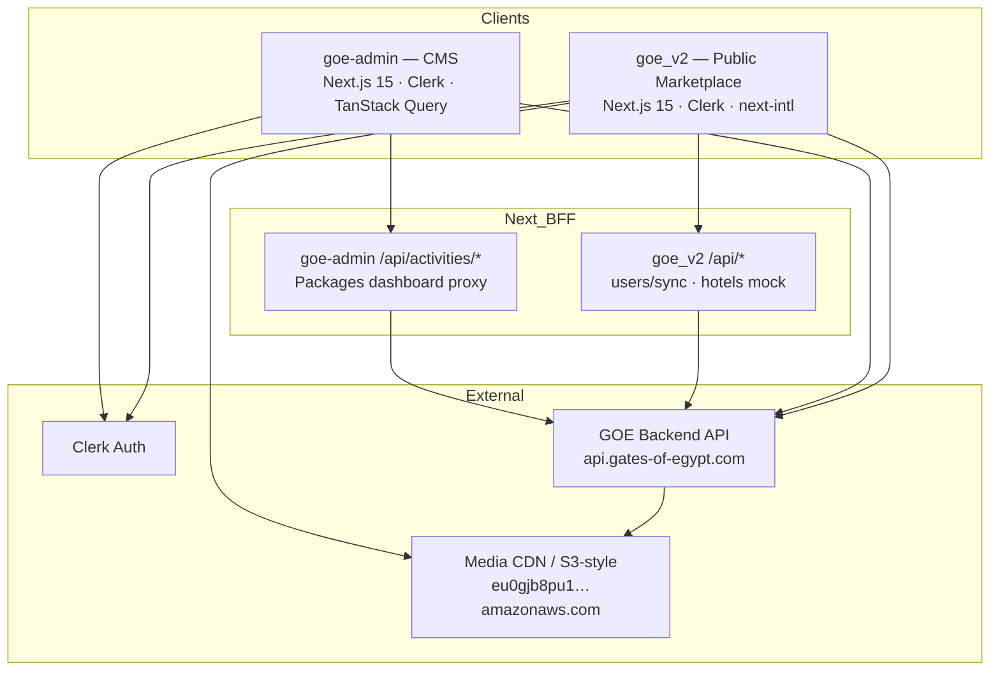

# Gates of Egypt (GOE) — Portfolio Case Study

> Copy sections freely into your personal site, résumé, or case-study PDF.  
> Metrics marked `[…]` are placeholders — replace with real numbers when available.

---

## 1. Project Overview

**Gates of Egypt (GOE)** is a multi-surface travel platform for discovering and booking Egyptian experiences: curated **activities**, **hotel stays**, and immersive **EgyTales VR tours**. The workspace ships two Next.js apps:

| App | Path | Audience |
|-----|------|----------|
| **Public marketplace** | `goe_v2/` | Travelers / end users |
| **Admin CMS** | `goe-admin/` | Internal content operators |

Both talk to a shared backend at `https://api.gates-of-egypt.com/api` (via `API_BASE_URL` / `NEXT_PUBLIC_API_BASE_URL`) with `X-API-Key` authentication.

### Brand identity (from production frontend)

| Token | Value |
|-------|--------|
| **Brand name** | Gates of Egypt / Gates Of Egypt |
| **Logo** | `goe_v2/public/logo.png` (“Gates of Egypt Logo”) |
| **Font** | **Montserrat** (`next/font/google`, `--font-montserrat`) |
| **Gold** | `#D2AC71` (`gold`) · hover `#9D8156` · soft `#EBDEBC` |
| **Primary green** | `#346D52` (`darkGreen`) · hover `#459C72` (`green`) |
| **Cream** | `#F6EEE5` (`creme`) · page bg ≈ `#F6F4EE` |
| **Neutrals** | `#121212` coal · `#131716` swamp · `#1A2820` lite swamp |

Admin CMS uses a separate **zinc** shadcn theme (near-black primary `#18181b`, sidebar `#fafafa`) — intentional ops UI, not consumer gold/green branding.

---

## 2. My Role — Frontend Developer (React)

**Role:** Frontend Developer (React / Next.js)  
**Scope:** End-to-end ownership of the traveler-facing marketplace UI and the internal activity/packages CMS, including architecture decisions around App Router, i18n/RTL, auth-adjacent flows, and API integration layers.

### Responsibilities I owned

- Designed and implemented **locale-first App Router** surfaces (`/[locale]/…`) with next-intl, Arabic RTL, and 9 language packs.
- Built **Activities**, **Hotels**, and **VR Tours (EgyTales)** modules: landing marketing, URL-driven search/filters, detail booking UIs, galleries, and post-subscribe VR experiences.
- Integrated **Clerk** (modal sign-in/up, UserButton, JWT → BFF user sync / onboarding).
- Authored API clients with **mock fallbacks**, ISR/`revalidate` strategies, and Next.js BFF routes where needed.
- Built the **GOE Admin** CMS shell (sidebar + top bar), dashboard, activities CRUD (create/edit tabs), and nested **packages** management with TanStack Query mutations.
- Established design systems: brand Tailwind tokens + shadcn/Radix on public; zinc shadcn + Tailwind v4 on admin.
- Ensured responsive layouts, theme toggle (light/dark), and reusable UI primitives (cards, carousels, pickers, dialogs).

### What I personally built / owned (portfolio talking points)

- Activity search with price/category/city filters, sort, pagination, and shareable query strings  
- Activity detail: Embla gallery, cream booking sidebar, service-provider selection (Zustand), accordion content (overview, packages, timeline, media embeds)  
- Hotels marketing + search + Airbnb-style detail (gallery, amenities, reserve card, room types)  
- EgyTales VR funnel: marketing → catalog filters → tour detail subscribe dialog → subscribed player/downloads/feedback  
- Admin: SSR activity lists with client filters, multi-tab create/edit forms, FormData PATCH with field diffs, packages table/overview/create/edit  
- Cross-cutting: language switcher, theme toggle, Clerk onboarding sync (`POST /api/users/sync`), RTL mirroring patterns  

---

## 3. Problem / Solution

### Problem

Travelers exploring Egypt face fragmented discovery across activities, stays, and cultural learning. Operators need a reliable way to publish tours, packages, pricing, and media without shipping code. The product also needs to serve **global audiences** (including Arabic RTL) while staying brand-consistent (gold / green / cream).

### Solution

A dual-app platform:

1. **Public Next.js marketplace** — one branded experience for Activities, Hotels, and EgyTales VR, with deep localization and progressive API integration (live activities/tours + graceful mocks).
2. **Clerk-protected Admin CMS** — operators manage activity content and per-activity service packages against the GOE API, with dashboard visibility into inventory health.

---

## 4. High-Level Architecture



### Text summary

```
Traveler Browser ──► goe_v2 (App Router + i18n middleware)
                        │
                        ├─► Clerk (session / JWT)
                        ├─► GOE API (Activities, Categories, Tours, …)
                        └─► /api/users/sync (BFF → GOE + Clerk metadata)

Operator Browser ──► goe-admin (Clerk middleware protects /home/*)
                        │
                        ├─► Server actions / SSR → GOE API
                        └─► /api/activities/* BFF for CSR reads
```

---

## 5. Full Feature Breakdown — Public Marketplace (`goe_v2`)

Locale prefix: `/{locale}` where locale ∈ `en | ar | fr | de | es | pt | ru | it | uk`.

### Global chrome

| Feature | What it does |
|---------|----------------|
| **Header** | Sticky frosted bar: logo, nav (AI Guide, Activities, VR Tours, Hotels), search icon, language switcher, theme toggle, Clerk Sign In / Sign Up / UserButton |
| **Footer** | Brand blurb + Destinations / Company / Support link columns (i18n) |
| **Theme** | `next-themes` class-based light/dark with gold/green CSS variables |
| **Language switcher** | Globe dropdown; switches locale while preserving pathname + query |

### Home — `/{locale}`

Placeholder welcome with link into Activities. Primary product landings live under Activities / Hotels / VR Tours (home is not the marketing hero yet).

### Activities — `/{locale}/activities`

**Landing:** Hero (Unsplash pyramids + glass `SearchForm`), Popular Destinations city cards, Featured Activities (category tabs + cards from API), Why Us, Testimonials, dark-green CTA (“Sign Up”).

**Search — `/activities/search`:** URL-driven `q`, `category`, `city`, `page`, `sort`, `minPrice`, `maxPrice`. Sidebar (desktop) / drawer (mobile): price slider, categories from `GET /Categories?Type=explore`, city checkboxes. Sort by rating/reviews/priority. Paginated `ActivityCard` grid.

**Detail — `/activities/[citySlug]/[activitySlug]`:** Breadcrumb, title, gallery + cream booking panel (date, guests, service providers via Zustand `useProviderStore`, “Check Availability”, free-cancellation notice), “Trip in a Blink”, accordion (overview, included, packages, pickup, timeline, media embeds, information).

### Hotels — `/{locale}/hotels`

**Landing:** Full-bleed EgyBook hero (`/hotels/egybook-hero.webp`), search strip (“Explore Stays”), carousels (most relevant / new / trending), feature icons (smart booking, VR preview, best price), preview CTA.

**Search — `/hotels/search`:** Same shell pattern as activities with places + cities + price filters.

**Detail — `/hotels/[hotelSlug]`:** Sticky header, multi-image gallery, amenities, description, host, location, reviews, VR teaser, room types, sticky booking card (dates, guests, fees, Reserve — UI complete; payment placeholder). Data from `MOCK_HOTELS` / summaries (hotels API client is mock-backed).

### VR Tours / EgyTales — `/{locale}/vr-tours`

**Landing:** Dark hero (`egy-tales-hero-vr.webp`), Get Started CTA, community avatar card, feature mosaic, preview section, top VR experiences grid.

**Catalog — `/vr-tours/tours`:** “Explore Egypt's Greatest Wonders”; category chips + status filters (All / Available / Subscribed / Booked); gold-bordered tour list cards.

**Detail — `/vr-tours/[tourId]`:** Full-bleed hero, Subscribe Now ($1.99 one-time dialog) / Start Tour if subscribed, More Info; artifacts & reviews sections.

**Subscribed — `/vr-tours/[tourId]/subscribed`:** Post-purchase UX — VR player section, downloads, feedback.

### Other public routes

| Route | Purpose |
|-------|---------|
| `/search` | Redirects to `/activities/search` (query preserved) |
| `/onboarding` | Post-auth sync of user profile to GOE API + Clerk `onboardingComplete` |
| `/testcart` | Dev authenticated cart viewer (`GET /cart`) — not in main nav |

### Nav note

Header links to `/ai-guide`, but **no page exists** yet (dead link). Souvenirs nav item is commented out.

---

## 6. Full Feature Breakdown — Admin CMS (`goe-admin`)

Protected under `/home/*` via Clerk middleware. Brand in shell: **“Activity Dashboard” / “Manage your tours”**.

### Auth — `/auth/sign-in`

Full-screen Clerk `<SignIn />` with custom card styling (`#fafafa`, 20px radius). Sign-out returns to `/auth/sign-in`.

### Dashboard — `/home`

- **Stats cards:** Total Activities, Total Packages, Average Rating, Total Reviews (computed from loaded activities; “+N from last month” strings are static placeholders).
- **Categories:** Explore category badges from API.
- **Recent Activities:** Image rows with city, rating, package count, starting price, Edit / View Details actions.

### Activities list — `/home/activities`

SSR-loaded inventory with client:

- Search (debounced), category/city filters, sort (name / rating / reviews)  
- Grid ↔ list view toggles; URL sync (`search`, `category`, `city`, `sort`, `view`, `page`)  
- Load more; activity cards with Edit / Packages / View  
- **Add Activity** → `/home/activities/add`

### Create activity — `/home/activities/add`

Multi-tab form:

1. **Basic Info** — name*, slug*, trip-in-blink, overview, description, priority  
2. **Program Details** — highlights, included/excluded, what to bring, guidelines  
3. **Media** — images, TikTok/URLs  
4. **Categories & Location** — city*, categories*  

Validates via toasts; `POST /Activities`; navigates into the new activity flow.

### Edit activity — `/home/activities/[activitySlug]/[citySlug]`

Hero summary + **Activity Editor** with **Save All Changes** (diff-only `FormData` `PATCH`). Tabs: Basic Info · Program Details · Media & Links · Images · Packages. Delete activity supported.

### Packages — `/home/activities/[activitySlug]/[citySlug]/packages`

Nested CMS for service providers on one activity:

- Header mini-stats (count, price range, avg rating)  
- Tabs: **Overview** · **All Packages** (table) · **Create Package** · **Edit Package**  
- Create/edit sub-tabs: Basic Info · Timeline · Pickup Locations · Images  
- Fields include starting price, guide name/title/bio, inclusions, restrictions, etc.  
- Mutations: `POST/PATCH/DELETE` `/packages`; dashboard list via BFF → `/Packages/dashboard`

### Sidebar items without pages (planned)

`/home/packages`, `/home/reviews`, `/home/users`, `/home/settings` — linked in nav, **not implemented**.

---

## 7. Auth, Permissions & Modes

| Concern | Public (`goe_v2`) | Admin (`goe-admin`) |
|---------|-------------------|---------------------|
| Provider | Clerk (`@clerk/nextjs`) | Clerk |
| UX | Modal Sign In / Sign Up; UserButton | Dedicated `/auth/sign-in`; UserButton + Sign out |
| Middleware | Clerk + next-intl; **route protection matchers currently commented out** (pages public) | `clerkMiddleware` + `createRouteMatcher(['/home(.*)'])` → redirect to sign-in |
| Onboarding | `/onboarding` → `POST /api/users/sync` → GOE `/users/sync` + Clerk `publicMetadata.onboardingComplete` | N/A |
| Roles | Sync payload sends `role: "User"` | No fine-grained RBAC in frontend — access = authenticated Clerk user for `/home/*` |
| Dual modes | Light/dark theme; LTR/RTL by locale | Light zinc shell (dark tokens exist; theme provider not mounted at root) |
| Unused | — | `next-auth` installed but not wired |

**RBAC note for portfolio honesty:** Admin is “authenticated staff via Clerk,” not a custom permission matrix (no per-resource roles in UI). Backend API key + JWT gate data access.

---

## 8. Tech Stack Tables

### Public marketplace — `goe_v2`

| Layer | Stack |
|-------|--------|
| Framework | Next.js **15.2.4** App Router, React **19**, TypeScript |
| Package manager | Yarn **4.9.2** |
| Auth | Clerk 6.x |
| i18n | next-intl **4.x** · 9 locales · Arabic RTL |
| Styling | Tailwind **3.4** · shadcn/Radix · Montserrat |
| State | Zustand (provider selection) |
| Forms | react-hook-form · Zod (available) |
| Motion / media | Framer Motion · Embla Carousel · react-social-media-embed |
| Dates | date-fns · react-day-picker |
| Theme | next-themes |
| Backend | GOE REST API · `X-API-Key` · Accept-Language |

### Admin CMS — `goe-admin`

| Layer | Stack |
|-------|--------|
| Framework | Next.js **15.3.4** (Turbopack dev), React **19**, TypeScript |
| Package manager | Bun (`bun.lock`) |
| Auth | Clerk 6.x (middleware-protected `/home`) |
| Data | TanStack Query **5** · Server Actions / SSR |
| Styling | Tailwind **CSS v4** · shadcn **new-york / zinc** · Lucide |
| Feedback | Sonner + use-toast |
| Forms | Controlled `useState` tabs (RHF/Zod installed, lightly used) |
| Backend | Same GOE API + Next BFF proxies |

---

## 9. Cross-Cutting Features

| Feature | Where | Notes |
|---------|-------|-------|
| **i18n** | `goe_v2` | 9 languages; message JSON under `src/i18n/messages/` |
| **RTL** | `goe_v2` | `dir="rtl"` for `ar`; mirrored flex/icons in hotels, VR, pickers |
| **Theme (light/dark)** | `goe_v2` | Header toggle; CSS variables in `globals.css` |
| **Clerk auth** | Both | Sessions, JWT templates (`default`), UserButton |
| **User sync BFF** | `goe_v2` | `/api/users/sync` bridges Clerk → GOE users |
| **API key auth** | Both | `X-API-Key` to GOE backend |
| **Mock fallbacks** | `goe_v2` | Activities/tours degrade to constants; hotels fully mocked |
| **ISR / revalidate** | Both | Marketing pages ~3600s; admin tags for activities/categories/cities |
| **Image CDN** | Both | Remote patterns for GOE media host |
| **Social embeds** | `goe_v2` | YouTube / TikTok in activity media accordion |
| **Maps** | Hotels detail | Location section + Google Maps-style URLs in mock data |
| **Cart API (dev)** | `goe_v2` `/testcart` | Authenticated cart read — not productized in nav |
| **FCM / push** | — | **Not present** in this repo |
| **Excel export** | — | **Not present** in this repo |
| **Realtime chat** | — | **Not present** in this repo |

---

## 10. Feature Checklist

### Public marketplace

- [x] Locale-prefixed App Router (`/[locale]/…`)
- [x] 9 languages + Arabic RTL
- [x] Brand header / footer / Montserrat / logo
- [x] Light / dark theme toggle
- [x] Clerk modal auth + UserButton
- [x] User onboarding sync to GOE API
- [x] Activities landing (hero, destinations, featured, social proof, CTA)
- [x] Activities search (filters, sort, pagination, URL state)
- [x] Activity detail (gallery, booking panel, accordion, media)
- [x] Service provider selection (Zustand)
- [x] Hotels landing (EgyBook hero + carousels + features)
- [x] Hotels search + detail booking UI
- [x] EgyTales VR marketing landing
- [x] VR tours catalog with status filters
- [x] VR tour detail + subscribe dialog UI
- [x] Post-subscribe VR / downloads / feedback page
- [x] Search redirect `/search` → activities search
- [ ] AI Guide page (nav only — route missing)
- [ ] Live hotel inventory API (UI mock-backed)
- [ ] Production payment for VR / hotel Reserve / activity checkout
- [ ] Global cart UX in main nav

### Admin CMS

- [x] Clerk-protected `/home/*`
- [x] Sign-in page + sign-out
- [x] Sidebar shell + top bar titles
- [x] Dashboard stats / categories / recent activities
- [x] Activities list (search, filter, sort, grid/list, load more)
- [x] Create activity (multi-tab)
- [x] Edit activity (diff PATCH, delete)
- [x] Nested packages overview / table / create / edit / delete
- [x] BFF proxies for activities & packages dashboard
- [ ] Top-level Packages page (`/home/packages`)
- [ ] Reviews module
- [ ] Users module
- [ ] Settings module
- [ ] Role-based permission matrix in UI

---

## 11. UX & Design Notes

### Public brand UI

- **Palette:** Gold CTAs for premium booking moments (`#D2AC71`); dark green for primary actions and badges (`#346D52`); cream panels (`#F6EEE5`) for booking sidebars and “Trip in a Blink.”
- **Typography:** Montserrat throughout — bold heroes (`text-4xl`–`6xl` / `7vmin` on VR), medium nav, muted metadata.
- **Hero pattern:** Full-bleed photography + dark gradient overlay + frosted glass search (activities) or pill search (hotels) or dual CTA + community card (VR).
- **Cards:** Soft borders, green discount/badge pills, star ratings in gold/primary; hotel cards use city chips + heart save affordance.
- **Motion:** Framer Motion on heroes and filter chips — presence, not noise.
- **RTL:** Not an afterthought — document `dir` plus component-level mirroring so Arabic feels native.

### Admin ops UI

- Zinc neutrals, 256px sidebar, 64px top bar — dense CMS readability over brand spectacle.
- Tabbed editors keep long forms scannable; toast validation keeps operators unblocked.
- Tables for packages emphasize provider, price, rating, timeline, locations, actions.

---

## 12. Challenges & What I Learned

1. **Locale + auth middleware composition** — Combining Clerk and next-intl middleware without breaking API routes or onboarding redirects; learned to isolate matchers and keep i18n off `/api`.
2. **RTL as a product requirement** — Document direction alone is insufficient; pickers, carousels, and icon buttons need explicit mirroring.
3. **Resilient API UX** — Shipping marketing pages with `revalidate` + mock fallbacks so demos and degraded networks still show real layouts.
4. **CMS form complexity** — Multi-tab activity/package editors with image delete tracking and FormData PATCH diffs; keeping client state aligned with SSR payloads.
5. **Dual design systems in one monorepo** — Consumer gold/green vs admin zinc: separate tokens prevent “brand leakage” into ops tools.
6. **Honest incomplete surfaces** — Booking/payment hooks and hotel live data are UI-ready; wiring payments taught me to design placeholders that still feel product-real for stakeholders.

---

## 13. Impact (fill in metrics)

- Enabled discovery across **[X]** activity categories and **[Y]** destination cities for travelers in **9** languages (incl. Arabic RTL).
- Reduced content publishing friction for operators managing activities + packages via CMS (vs. manual API/code changes) — **[~Z% faster publish cycle]**.
- Delivered a unified brand experience (logo, Montserrat, gold/green) across Activities, Hotels, and EgyTales funnels.
- Established Clerk-based identity with backend user sync for **[N]** onboarded users.
- Built admin dashboard visibility into inventory (activities, packages, ratings, reviews aggregates) used by **[M]** operators.
- Preview/marketing assets (`preview.html` + `preview-shots/`) accelerated stakeholder reviews and App Store / portfolio screenshots — **[T hours]** saved in design QA.

---

## 14. Copy-Paste Blurbs

### Short (2–3 sentences)

I build the Gates of Egypt travel platform as a Frontend Developer (React/Next.js): a multilingual public marketplace for activities, hotels, and EgyTales VR tours, plus a Clerk-protected admin CMS for activities and packages. I owned locale/RTL UX, brand design systems, App Router feature modules, and GOE API integration with resilient mock fallbacks.

### Medium case study

**Gates of Egypt** is a dual-app travel product: a consumer Next.js 15 marketplace and an internal CMS. On the public side I implemented Activities (search, filters, detail booking UI), Hotels (marketing + detail), and EgyTales VR (catalog → subscribe → post-purchase), with next-intl across nine languages and first-class Arabic RTL. Auth uses Clerk with a BFF user-sync/onboarding path. On the admin side I built the Activity Dashboard—SSR lists, multi-tab create/edit forms, and nested package management with TanStack Query—talking to `api.gates-of-egypt.com`. Brand work centered on Montserrat, gold `#D2AC71`, green `#346D52`, and cream surfaces using the real logo asset.

### Long narrative

When I joined the Gates of Egypt frontend, the goal was a traveler-facing experience that felt premium and localizable, paired with tools for operators to keep inventory fresh. I structured the public app around the App Router and `[locale]` segments, composing Clerk with next-intl middleware so marketing pages stayed fast while auth and sync remained available. Activities became the deepest vertical: URL-driven search, category/city/price filters, Embla galleries, and a cream booking rail with Zustand-backed provider selection. Hotels and VR Tours followed the same design language—gold and dark green accents, Montserrat, frosted headers—while VR introduced a distinct EgyTales funnel ending in a subscribed experience. For operators, I delivered GOE Admin: a zinc shadcn shell, dashboard aggregates, and a full activities/packages CMS with tabbed editors and FormData updates against the shared API. Challenges included RTL fidelity, resilient API fallbacks, and keeping payment/booking UI honest where backends were still catching up. The result is a coherent portfolio piece spanning consumer UX, i18n, auth, and real CMS workflows in one monorepo.

---

## 15. Portfolio Tags

`React` · `Next.js 15` · `TypeScript` · `App Router` · `Tailwind CSS` · `shadcn/ui` · `Radix UI` · `Clerk Auth` · `next-intl` · `i18n` · `RTL` · `Zustand` · `TanStack Query` · `Framer Motion` · `Embla Carousel` · `Travel Tech` · `Marketplace` · `CMS` · `BFF` · `REST API` · `Design Systems` · `Responsive UI` · `Dark Mode`

---

## 16. Suggested Screenshots Mapping (`preview-shots/` + `preview.html`)

Open HTML files locally in a **1280×720** viewport and capture.

### Marketing / brand (no copy / atmospheric)

| File | Use in portfolio |
|------|------------------|
| `preview.html` | Hero cover / project thumbnail |
| `01-main-product-showcase.html` | Product vibe — activities UI chrome |
| `03-core-capability-search.html` | Search & filter capability |
| `05-key-capability-vr.html` | EgyTales / VR capability |
| `06-brand-splash-a.html` | Logo + brand marks |
| `11-brand-splash-b.html` | Alternate brand composition |

### Public app-realistic UI

| File | Maps to |
|------|---------|
| `02-app-activities-home.html` | `/activities` landing |
| `04-app-activities-search.html` | `/activities/search` |
| `07-app-activity-detail.html` | Activity detail + booking |
| `08-app-hotels-home.html` | `/hotels` |
| `09-app-hotels-search.html` | `/hotels/search` |
| `10-app-hotel-detail.html` | Hotel detail |
| `12-app-vr-tours-home.html` | `/vr-tours` |
| `13-app-vr-tours-catalog.html` | `/vr-tours/tours` |
| `14-app-vr-tour-detail.html` | VR tour detail / subscribe |

### Admin app-realistic UI

| File | Maps to |
|------|---------|
| `15-admin-dashboard.html` | `/home` |
| `16-admin-activities-list.html` | `/home/activities` |
| `17-admin-activity-create.html` | `/home/activities/add` |
| `18-admin-activity-edit.html` | Activity edit |
| `19-admin-packages.html` | Nested packages CMS |
| `20-admin-sign-in.html` | `/auth/sign-in` |

**Suggested case-study sequence:** brand splash → activities home → search → detail → VR home → admin dashboard → packages table.

---

## 17. Repo Structure

```
goe/
├── PORTFOLIO.md                 ← this file
├── preview.html                 ← marketing cover (1280×720)
├── preview-shots/               ← static HTML screenshot set
│   ├── 01–11 … marketing + public UI
│   └── 15–20 … admin UI
├── goe_v2/                      ← Public marketplace (Gates of Egypt)
│   ├── package.json             ← Yarn 4 · Next 15.2
│   ├── next.config.mjs          ← next-intl plugin
│   ├── tailwind.config.ts       ← brand color tokens
│   ├── public/                  ← logo.png, hotels/, vr-tours/, Flags/, …
│   └── src/
│       ├── app/
│       │   ├── [locale]/layout.tsx · page.tsx
│       │   ├── [locale]/(routes)/
│       │   │   ├── activities/…
│       │   │   ├── hotels/…
│       │   │   ├── vr-tours/…
│       │   │   ├── onboarding/
│       │   │   ├── search/
│       │   │   └── testcart/
│       │   └── api/users/sync · hotels · …
│       ├── components/          ← layout, custom cards, hotel, ui (shadcn)
│       ├── i18n/                ← routing + messages/{en,ar,…}.json
│       ├── lib/api · config · constants · types
│       ├── store/useProviderStore.ts
│       └── middleware.ts        ← Clerk + next-intl
└── goe-admin/                   ← Internal CMS (GOE Admin)
    ├── package.json             ← Bun · Next 15.3
    ├── app/
    │   ├── layout.tsx · page.tsx → /home
    │   ├── auth/sign-in/
    │   ├── home/                ← dashboard · activities · packages
    │   └── api/activities/…
    ├── components/              ← layout, dashboard, activities, packages, ui
    ├── lib/api · server-config · server-api
    └── middleware.ts            ← Clerk protects /home/*
```

### Backend touchpoints (shared)

| Resource | Typical endpoints |
|----------|-------------------|
| Activities | `GET/POST /Activities`, `GET/PATCH/DELETE …/{slug}/city/{city}` |
| Categories | `GET /Categories?Type=explore` (tales: `Type=tales`) |
| Cities | `GET /Cities` |
| Tours (VR) | `GET /Tours`, `GET /Tours/slug/{slug}`, contents & ratings |
| Packages | `POST/PATCH/DELETE /packages`, `GET /Packages/dashboard` |
| Service providers | `GET /ServiceProviders` |
| Users | `POST /users/sync` |
| Cart (dev) | `GET /cart` |

---

*Generated from the Gates of Egypt monorepo (`goe_v2` + `goe-admin`). Update placeholders and screenshots as the product evolves.*
