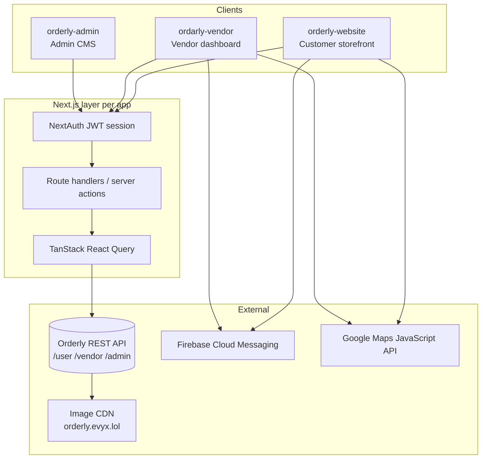

# Orderly — Portfolio Case Study

> Food ordering & restaurant marketplace platform (Egypt) — bilingual EN/AR, dual brand modes, customer storefront + vendor ops console + admin CMS.
>
> **Product name:** Orderly  
> **Primary brand color:** Teal `#129575` / `hsla(166, 79%, 33%, 1)`  
> **Accent:** Orange `#FF9D00` · GenZ purple `#A259FF` → mint `#00F0B5`  
> **Fonts:** Poppins, Chillax, Zain, Beiruti  
> **Logo:** Orderly wordmark (`orderly.svg`) with teal checkmark accent (`#2C8B57`)

---

## 1. Project overview

**Orderly** is a multi-tenant F&B ordering platform built for the Egyptian market (EGP). Customers discover restaurants and coffee shops, then order **dine-in**, **takeaway**, or **delivery**. Vendors run day-to-day restaurant operations from a permissioned dashboard. Platform admins onboard vendors, manage geography, loyalty rules, coupons, and payouts from a separate CMS.

The experience is fully bilingual (**English / Arabic**) with true **RTL** layout. The customer site also offers two visual brand modes — **General** (teal, Poppins/Zain) and **GenZ** (purple→mint gradient, Chillax/Beiruti) — so the same product can speak to different audiences without forking the app.

This repository contains **three independent Next.js frontends** that talk to a shared external REST API:

| App folder | Audience | Role |
|------------|----------|------|
| `orderly-website` | End customers | Public storefront, cart, checkout, profile, loyalty |
| `ordarly-vendor` | Restaurant staff | Orders, menu, branches, zones, promotions, RBAC |
| `orderly-admin` | Platform operators | Vendors, geography, points rules, notifications, payouts |

**Who it’s for**

- Diners who want one place to browse and order across restaurants & cafés
- Restaurant owners and branch managers who need ops tools (menu, tables, delivery zones, staff)
- Internal Orderly operators who manage the marketplace, loyalty, and vendor lifecycle

**Brand identity (from codebase)**

| Token | Value |
|-------|--------|
| Main (General) | `#129575` / `hsla(166, 79%, 33%, 1)` |
| Secondary surface | `#E0EFED` |
| Accent orange | `#FF9D00` / `hsla(37, 100%, 50%, 1)` |
| Ink / logo dark | `#1B1E3A` |
| GenZ purple → mint | `#A259FF` → `#00F0B5` |
| Dashboard content bg | `#FCFCFD` |
| Logo assets | `orderly.svg`, `orderly_footer.svg`, `white-logo.svg`, `logo.svg` |
| Fonts | Poppins (EN), Chillax (EN GenZ), Zain (AR), Beiruti (AR GenZ) |

---

## 2. My role — Frontend Developer (React)

**Role:** Frontend Developer (React / Next.js)  
**Scope:** End-to-end UI ownership across the customer website, vendor dashboard, and admin CMS — App Router architecture, design-system implementation, data-fetching layer, auth UX, i18n/RTL, and production-ready feature screens.

### Responsibilities I owned

- Built and maintained **three Next.js App Router** frontends (React 19, TypeScript, Tailwind CSS 4, shadcn/Radix)
- Translated product requirements into locale-aware routes under `[locale]` (`en` / `ar`) with full RTL support
- Implemented **NextAuth (Credentials + JWT session)** flows for customers (mobile + OTP), vendors, and admins
- Designed the **React Query + server-actions / BFF API routes** pattern for cart, orders, menus, and dashboard data
- Owned **RBAC-aware UI** on vendor and admin apps: permission constants, sidebar gating, page-level `/forbidden` redirects, action-level button visibility
- Shipped the customer **dual theme system** (`general` / `genz` via `data-theme`, Framer Motion theme switcher, theme-specific assets)
- Integrated **Google Maps** (addresses, branch areas, delivery zone polygons) and **Firebase Cloud Messaging** (web push + service worker)
- Built operational tooling: **Recharts** dashboards, **Excel (xlsx)** exports, **jsPDF** invoice downloads
- Ensured accessible forms with **React Hook Form + Zod**, OTP inputs, toasts (Sonner), and consistent shadcn patterns

### What I personally built / owned (highlight reel)

- Customer discovery → vendor menu → product → cart → checkout → order tracking pipeline
- **Group cart** UX (QR join, share link, member view)
- Profile suite: addresses (maps), orders, loyalty points, referral share
- Vendor ops: dashboard stats/charts, orders table, menu CRUD, hot deals, happy hours, branches/zones, employees & roles
- Admin CMS: multi-step vendor onboarding UI, governorates/cities, points rules, vendor notifications, platform coupons & bills
- Permission system wiring (`VENDOR_PERMISSIONS` / `ADMIN_PERMISSIONS` → `useUserAccess` → sidebar + page guards)
- EN/AR message catalogs, RTL layouts, Arabic-Indic number formatting for EGP

---

## 3. Problem / solution

### Problem

Restaurants in Egypt often juggle fragmented channels (phone orders, walk-ins, third-party apps) with weak tools for dine-in tables, takeaway, and delivery under one brand. Customers bounce between apps; operators lack a bilingual, permissioned console for menu, staff, and zones; the platform needs a CMS to onboard vendors and run loyalty at scale.

### Solution

Orderly unifies the marketplace into three purpose-built frontends on one API:

1. **Customer website** — Discover places, order in three modes, checkout, track, earn points, refer friends — in EN or AR, General or GenZ brand.
2. **Vendor dashboard** — Run the restaurant: live orders, menu/add-ons, promotions, multi-branch maps & zones, staff RBAC, exports.
3. **Admin CMS** — Operate the platform: vendors, geography, coupons, points rules, notifications, payouts.

---

## 4. High-level architecture



**Text diagram**

```
[Browser EN|AR]
    │
    ├─ orderly-website  ── NextAuth (mobile) ──► API /user/*
    │       │                                      │
    │       ├─ FCM SW                              ├─ images @ orderly.evyx.lol
    │       └─ Google Maps (addresses)             │
    │                                              │
    ├─ ordarly-vendor   ── NextAuth (email) ──► API /vendor/*
    │       │                                      │
    │       ├─ RBAC permissions on session         │
    │       ├─ FCM + Maps (zones/branches)         │
    │       └─ Excel / PDF / Recharts              │
    │                                              │
    └─ orderly-admin    ── NextAuth (email) ──► API /admin/*
            │
            ├─ RBAC permissions on session
            └─ Excel / PDF / Recharts
```

**Notes**

- No in-repo backend or shared `packages/` workspace — three deployable Next.js apps (`output: "standalone"`)
- Client sessions store the API bearer token; requests attach it via auth helpers
- Currency: **EGP**; locales: **`en`**, **`ar`**

---

## 5. Full feature breakdown

### 5.1 Customer website (`orderly-website`)

#### Homepage `/`
Marketing and discovery hub: hero search, **Discover By Type** (restaurant, café, pastries, other), **Top Rated Places** and **Nearest Places** carousels, happy-hours / promo sliders, how-it-works, and app-download CTA with store badges. Supports GenZ asset variants and decorative brand vectors.

#### Vendors by place type `/vendors/[placeId]`
Filtered listing of restaurants/coffee shops for a place category. Search + filter sidebar (place type, categories, price range). Place cards show cover, logo pill, rating.

#### Restaurant storefront `/vendors/[placeId]/[restaurantSlug]`
Vendor banner, overlapping logo, ratings, **Choose Order Type** (dine-in / takeaway / delivery), menu tabs, product grid cards (price, favorites, add-to-cart). Supports group-order entry points.

#### Vendor details `/vendors/.../details`
Extended branch/info for the selected restaurant.

#### Dine-in `/vendors/.../dine-in`
Table / area selection flow when ordering to eat in.

#### Product detail `/vendors/.../[productName]`
Dish detail with images, description, price, **add-ons**, quantity stepper, add-to-cart.

#### Favourites `/favourite/vendors` · `/favourite/meals`
Saved vendors and meals for quick reorder / revisit (auth-gated).

#### Cart `/cart`
Line items with counters, add-on chips, order summary (subtotal, service fee, taxes, total). Supports **group cart** creation, member dialogs, QR, and share.

#### Group cart member `/cart/[member_id]`
Join or view a shared group cart via invite/QR.

#### Checkout `/cart/checkout`
Accordion flow: review order → delivery info / takeaway datetime / dine-in selectors → payment method (**Cash on Delivery**) → place order. Coupon field on summary. Address picker for delivery.

#### Order tracking `/order/[id]`
Status timeline (placed → preparing → on the way → delivered), item list, delivery details, payment summary.

#### Auth
- `/auth/login` — mobile + password (NextAuth Credentials → `POST /user/login`)
- `/auth/register` — name, mobile, password, optional referral → OTP
- `/auth/verify` — OTP for register or forgot-password
- Forgot-password multi-step dialog (request → OTP → reset)

#### Profile
| Route | Feature |
|-------|---------|
| `/profile/info` | Avatar, full name, phone, email, password change |
| `/profile/addresses` | CRUD addresses with Google Maps picker |
| `/profile/orders` | Order history with status tabs |
| `/profile/points` | Loyalty balance, tier progress, activity |
| `/profile/refer` | Referral code + social share |
| `/profile/account-settings` | Account preferences |
| `/profile/terms` | Terms & conditions |

#### CMS content
`/about-us`, `/policy`, `/cookies` — content pages fed from the API/CMS HTML.

---

### 5.2 Vendor dashboard (`ordarly-vendor`)

#### Login `/login`
Email/password for vendor employees (`POST /vendor/login`). Session embeds `role.permissions`.

#### Dashboard `/`
Stat cards (total orders, revenue today, completed, cancelled), Recharts charts, recent orders table with status filter tabs (All / New / Preparing / On the way / Completed / Cancelled).

#### Orders `/orders` · `/orders/[orderId]`
Full orders table (customer, type, payment, date, total, status). Detail view for status management. **Excel export**.

#### Menu `/menu` · `/menu/add-edit-menu-item/[[...menuItemId]]`
Menu item list (name, price, category, status) + add/edit forms. Items can carry a **GenZ** flag for customer theme targeting.

#### Categories `/categories`
Vendor menu categories management.

#### Add-ons `/add-ons` · `/add-ons/[id]`
Addon categories and nested add-on options used on product customization.

#### Hot Deals `/hot-deals` · add-edit routes
Time-bound promotional deals surfaced to customers.

#### Happy Hours `/happy-hours` · add-edit routes
Scheduled happy-hour campaigns.

#### Branches `/branches` · `/branches/[branch_id]` · `/branches/.../[area_id]`
Multi-branch management, areas, and tables for dine-in capacity.

#### Zones `/zones`
Delivery zone polygons on **Google Maps** — define where delivery is available.

#### Customers `/customers`
Customer list with order history context; **Excel export**.

#### Coupons `/coupons`
Vendor coupon codes, usage limits, active/expired stats.

#### Banners `/banners`
Promotional banners for the storefront.

#### Reviews `/reviews` · `/reviews/[vendorId]`
Review moderation and rating visualizations (charts).

#### Bills `/bills` · Accounting `/accounting`
Invoices / payouts; PDF invoice download support (`jspdf`).

#### Employees `/employees`
Staff CRUD and status.

#### Roles `/roles`
Assign/remove permissions for vendor roles (`VENDOR_PERMISSIONS`).

#### Vendor Profile / Settings `/setting` · `/profile`
Vendor data, working days, password, profile view.

#### Forbidden `/forbidden`
Shown when the employee lacks page permission.

---

### 5.3 Admin CMS (`orderly-admin`)

#### Login `/login`
Admin email/password (`POST /admin/login`) with permissioned session.

#### Dashboard `/`
Platform-wide KPIs, Recharts, cross-vendor orders table.

#### Orders `/orders` · `/orders/[userId]` · `/orders/[userId]/[orderId]`
Browse orders by customer, drill into order detail; Excel export.

#### Vendors `/vendors` · `/vendors/add-edit-vendor/[[...slugs]]`
Vendor directory and **multi-step add/edit** onboarding (business data, services, status).

#### Customers `/customers`
Platform customer list + Excel export.

#### Governorates `/governorates` · `/governorates/[cityId]`
Geography tree: governorates → cities for delivery/address coverage.

#### Categories `/categories` · Add-ons `/addons` · `/addons/[addonId]`
System-level catalog taxonomy and platform add-ons.

#### Business Services `/business-services`
Configurable business service types for vendors.

#### Coupons `/coupons`
Platform coupon CRUD, activate/deactivate.

#### Points `/points`
Loyalty **points rules** configuration for the customer points program.

#### Notifications `/notifications`
Create / send / resend notifications to vendors.

#### Bills `/bills`
Vendor payouts and invoicing; PDF support.

#### Roles `/roles` · Employees `/employees`
Admin RBAC and staff management (`ADMIN_PERMISSIONS`).

#### Reviews `/reviews/[vendorId]`
Moderate vendor reviews (approve/toggle).

#### Profile `/profile` · Forbidden `/forbidden`
Admin profile and permission denial page.

---

## 6. Apps in depth

### A. Customer storefront — `orderly-website`

Public-facing product. Emphasizes discovery, conversion (cart/checkout), loyalty, and a distinctive dual-brand visual system. Auth protects cart, profile, favourites, and order routes via middleware.

### B. Vendor console — `ordarly-vendor`

Authenticated operations app for restaurant teams. Sidebar is permission-filtered. Core loop: accept/manage orders, keep menu & promotions fresh, configure branches/zones, manage staff.

### C. Admin CMS — `orderly-admin`

Internal tool for marketplace operators. Focus on vendor lifecycle, geography, loyalty rules, coupons, notifications, and financial bills — not end-customer ordering.

---

## 7. Auth, RBAC & dual modes

### Authentication

| App | Credentials | API | Session |
|-----|-------------|-----|---------|
| Website | Mobile + password; OTP for register/forgot | `/user/login`, `/user/register`, `/user/active-profile` | NextAuth JWT + API bearer; stores `genzMode`, `points`, `referralCode`, `fcmToken` |
| Vendor | Email + password | `/vendor/login` | JWT + `vendor_employee` + `role.permissions` |
| Admin | Email + password | `/admin/login` | JWT + `admin` + `role.permissions` |

Middleware / proxy guards redirect unauthenticated users to login and block protected customer routes when logged out.

### RBAC (vendor & admin)

- Permission string catalogs: `VENDOR_PERMISSIONS`, `ADMIN_PERMISSIONS`
- Session carries granted permissions from the API role
- `useUserAccess()` filters sidebar items
- `viewPagePermission(page)` on server pages → `/forbidden`
- `vendorSystemActions` / `adminSystemActions` map permissions to create/update/delete UI flags
- Website customers have **no RBAC** (account-only)

### Dual modes (customer)

| Mode | Theme attr | Look | Fonts |
|------|------------|------|-------|
| **General** | `data-theme="general"` | Teal primary, mint secondary surfaces | Poppins (EN), Zain (AR) |
| **GenZ** | `data-theme="genz"` | Purple→mint gradients, GenZ icons/vectors | Chillax (EN), Beiruti (AR) |

Switcher uses Framer Motion + `next-themes`; preference persisted (cookie / user `genz_mode`). Vendor menu items can be flagged for GenZ presentation.

---

## 8. Tech stack tables

### Customer — `orderly-website`

| Layer | Stack |
|-------|--------|
| Framework | Next.js ^16.1 (App Router, Turbopack, `standalone`) |
| UI | React 19, TypeScript, Tailwind CSS 4, shadcn/Radix, Lucide, Sonner |
| Motion | Framer Motion / Motion |
| Data | TanStack React Query 5, nuqs (URL state) |
| Forms | React Hook Form + Zod + `@hookform/resolvers` |
| Auth | NextAuth 4 (Credentials, JWT) |
| i18n | next-intl 4 (`en` / `ar`, RTL) |
| Maps | `@react-google-maps/api` |
| Push | Firebase 12 (FCM) |
| Other | Embla Carousel, input-otp, qrcode.react, react-share |

### Vendor — `ordarly-vendor`

| Layer | Stack |
|-------|--------|
| Framework | Next.js ^15.5, React 19, TypeScript, Tailwind 4, shadcn/Radix |
| Data | TanStack React Query 5 |
| Forms | RHF + Zod |
| Auth | NextAuth 4 |
| i18n | next-intl (`en` / `ar`, RTL sidebar) |
| Charts | Recharts 2.15 |
| Export | xlsx, file-saver, jspdf + jspdf-autotable |
| Maps | `@react-google-maps/api` |
| Push | Firebase FCM |
| UX | nextjs-toploader, cmdk, react-day-picker, input-otp |

### Admin — `orderly-admin`

| Layer | Stack |
|-------|--------|
| Framework | Next.js 16.0, React 19, TypeScript, Tailwind 4, shadcn/Radix |
| Data | TanStack React Query 5 |
| Forms | RHF + Zod |
| Auth | NextAuth 4 |
| i18n | next-intl (`en` / `ar`) |
| Charts | Recharts |
| Export | xlsx, file-saver, jspdf |
| Other | date-fns, qrcode, cmdk, react-day-picker |
| Not used | Firebase, Google Maps (admin has no map deps) |

---

## 9. Cross-cutting features

| Feature | Website | Vendor | Admin |
|---------|---------|--------|-------|
| EN / AR + RTL | Yes | Yes | Yes |
| EGP + locale number systems | Yes | Yes | Yes |
| NextAuth JWT + API bearer | Yes | Yes | Yes |
| Firebase FCM web push | Yes | Yes | No |
| Google Maps | Addresses | Branches / zones | No |
| Excel export | No | Orders, customers | Orders, customers, vendors |
| PDF invoices | No | Yes | Yes |
| Recharts dashboards | No | Yes | Yes |
| QR codes | Group cart | Download QR APIs | QR utilities |
| Social share | Referral / group cart | — | — |
| GenZ / General theme | Yes | Menu GenZ flags / shared CSS classes | Shared CSS classes |
| Image CDN | `orderly.evyx.lol` | Same | Same |
| Standalone Docker-ready build | Yes | Yes | Yes |

---

## 10. Feature checklist

### Customer website
- [x] Homepage discovery (types, top-rated, nearest, promos)
- [x] Vendor listing with filters
- [x] Restaurant menu + order type selection
- [x] Product detail with add-ons
- [x] Dine-in table flow
- [x] Cart with quantities & summary
- [x] Group cart (QR + share + member view)
- [x] Checkout (delivery / takeaway / dine-in + COD)
- [x] Order tracking
- [x] Favourites (vendors & meals)
- [x] Auth (login, register, OTP, forgot password)
- [x] Profile info, addresses (maps), orders, points, refer
- [x] GenZ / General theme switcher
- [x] FCM push notifications
- [x] Full EN/AR RTL
- [x] About / policy / cookies CMS pages
- [ ] Online payment gateways in checkout UI (cash-first today)

### Vendor dashboard
- [x] Auth + permissioned sidebar
- [x] Dashboard stats & charts
- [x] Orders list/detail + Excel
- [x] Menu CRUD (+ GenZ item flag)
- [x] Categories & add-ons
- [x] Hot deals & happy hours
- [x] Branches, areas, tables
- [x] Delivery zones (maps)
- [x] Customers + Excel
- [x] Coupons & banners
- [x] Reviews
- [x] Bills / PDF invoices
- [x] Employees & roles (RBAC)
- [x] Vendor settings / profile
- [x] FCM notifications
- [x] EN/AR RTL

### Admin CMS
- [x] Auth + RBAC
- [x] Platform dashboard
- [x] Orders by user/detail + Excel
- [x] Vendor multi-step CRUD
- [x] Customers + Excel
- [x] Governorates & cities
- [x] Categories, add-ons, business services
- [x] Coupons
- [x] Loyalty points rules
- [x] Vendor notifications (send/resend)
- [x] Bills / payouts + PDF
- [x] Roles & employees
- [x] Review moderation
- [x] EN/AR RTL
- [ ] Client-side payment gateway SDK (permissions exist for future gateways)

---

## 11. UX & design notes

- **Brand-first chrome:** Orderly wordmark in headers and browser-preview frames; teal (`#129575`) for primary actions and active nav.
- **Customer layout:** Fixed top nav (Home · Restaurants & coffee Shops · Favourite · cart · language · Sign in), generous homepage hero, rounded place/product cards (`rounded-[30px]` / `rounded-3xl`), mint surfaces (`#E0EFED`).
- **Order-type clarity:** Dedicated dine-in / delivery / takeaway icons and selection cards before menu commitment.
- **Orange accent** (`#FF9D00`) for ratings stars and checkout summary emphasis (`bg-custom-orange/20`).
- **GenZ mode:** Gradient CTAs, alternate hero/mobile assets, Chillax/Beiruti typography — same IA, different personality.
- **Dashboards:** Collapsible left sidebar (right in AR), white cards on `#FCFCFD`, status pills, search in top bar, soft icon circles for KPI tiles.
- **RTL is first-class:** `dir` on `<html>`, mirrored sidebars, Arabic copy from `messages/ar.json`, Arabic-Indic digits where configured.
- **Motion:** Theme switcher “orb” animation; carousels (Embla); restrained dashboard motion + top loader on navigation.

---

## 12. Challenges & what I learned

1. **Three apps, one product language** — Keeping shadcn tokens, teal brand, and i18n patterns consistent without a shared package taught disciplined duplication and clear API contracts.
2. **True RTL + dual themes** — Not just flipping `dir`: fonts, gradients, GenZ assets, and sidebar sides all had to resolve per locale × theme.
3. **RBAC that doesn’t leak UI** — Wiring the same permission strings through session, sidebar, page guards, and button-level actions avoided “visible but forbidden” traps.
4. **Cart complexity** — Solo cart, group cart (QR/share), and three fulfillment modes required careful URL/state design (`nuqs`, member routes) and resilient React Query invalidation.
5. **Maps in ops vs consumer** — Address picking for customers vs polygon zones for vendors needed different map UX on the same Maps API.
6. **BFF + external API** — NextAuth JWT holding the API token, route handlers, and server actions kept secrets and CORS sane while staying frontend-owned.
7. **Export tooling** — Excel/PDF for ops users is as important as pretty charts; learned to treat exports as first-class features, not afterthoughts.

---

## 13. Impact (placeholders)

- Supported **[X]** restaurant / café vendors on the marketplace  
- Enabled **[X]** customer orders across dine-in, takeaway, and delivery  
- Shipped full **EN + AR RTL** coverage across **3** production frontends  
- Reduced vendor ops friction with **Excel/PDF** exports on orders & customers  
- Dual brand modes (**General / GenZ**) without maintaining separate codebases  
- Permissioned vendor/admin access across **[N]** roles / employees  
- Push notification reach via FCM for **[X]** active devices  
- Checkout conversion / cart completion: **[X]%** (fill from analytics)  
- Average order tracking → completion time: **[X] min** (fill from analytics)

---

## 14. Copy-paste blurbs

### Short (2–3 sentences)

I built the frontend for **Orderly**, a bilingual (EN/AR) food-ordering platform serving customers, restaurant vendors, and platform admins. Using Next.js App Router, React 19, and TypeScript, I shipped a dual-theme customer storefront (General / GenZ), a permissioned vendor ops console, and an admin CMS — complete with NextAuth, React Query, Google Maps, FCM, and Excel/PDF exports.

### Medium case study

**Orderly** is an Egyptian F&B marketplace where diners order dine-in, takeaway, or delivery, vendors run menus and branches, and admins operate the network. As Frontend Developer (React), I owned three Next.js frontends on a shared REST API: a customer site with cart/group-order/checkout, loyalty points, referrals, and a GenZ visual mode; a vendor dashboard with RBAC, Recharts, map-based delivery zones, and promotions (hot deals / happy hours); and an admin CMS for vendor onboarding, geography, points rules, and notifications. The stack centers on TypeScript, Tailwind/shadcn, next-intl RTL, NextAuth JWT sessions, and TanStack Query — with Firebase FCM and Google Maps as key integrations.

### Long narrative

Restaurants needed one bilingual product that could feel premium for everyday diners and playful for GenZ — while giving kitchen and branch teams real operational control. I led frontend development across Orderly’s three App Router applications. On the customer website, I implemented discovery, multi-mode ordering, group carts with QR sharing, checkout, order tracking, and a profile suite spanning addresses (Maps), loyalty points, and referrals — all behind NextAuth mobile login and OTP, with a Framer Motion–driven General/GenZ theme system grounded in real brand tokens (teal `#129575`, orange accent, Chillax/Zain/Beiruti fonts). On the vendor side, I built the permission-aware shell: dashboard KPIs and charts, orders with Excel export, menu/add-on CRUD, hot deals and happy hours, multi-branch tables, and Google Maps delivery zones, gated by `VENDOR_PERMISSIONS`. For admins, I delivered the CMS surfaces for vendors, governorates/cities, coupons, loyalty rules, notifications, and bills, gated by `ADMIN_PERMISSIONS`. Working against an external API taught me to treat auth tokens, BFF routes, and React Query caches as product infrastructure — not glue code — and to design every screen for EN and AR from day one.

---

## 15. Portfolio tags

`Next.js` · `React` · `TypeScript` · `App Router` · `Tailwind CSS` · `shadcn/ui` · `Radix UI` · `TanStack Query` · `NextAuth` · `next-intl` · `RTL` · `i18n` · `React Hook Form` · `Zod` · `Firebase FCM` · `Google Maps` · `Recharts` · `Excel export` · `jsPDF` · `Framer Motion` · `Food tech` · `Marketplace` · `RBAC` · `Multi-tenant` · `EGP` · `Arabic UX` · `Design systems`

---

## 16. Suggested screenshots mapping (`preview-shots/`)

Use these HTML frames (open in browser → capture at 1280×720) or the underlying `shot-*.png` real UI captures:

| Portfolio slot | File | Shows |
|----------------|------|--------|
| Hero / cover | `preview.html` or `01-homepage-showcase.html` | Framed homepage hero (real RTL GenZ UI) |
| Discovery | `02-app-home-discover.html` | Discover-by-type + top-rated places |
| Listing | `03-app-vendors.html` | Vendors list + filters (Bazooka card) |
| Restaurant | `04-app-restaurant.html` | Vendor banner + order-type selection |
| Menu / offers | `05-app-menu-offers.html` | Special offers product cards |
| Brand / dual mode | `06-brand-general-mode.html` | GENERAL MODE theme splash |
| Full-bleed home | `07-app-home.html` | Homepage in edge-to-edge browser chrome |
| Brand splash B | `11-brand-splash-home.html` | Teal brand frame + home hero |
| Raw assets | `shot-home-hero.png`, `shot-home-discover.png`, `shot-vendors-list.png`, `shot-restaurant.png`, `shot-menu-offers.png`, `shot-general-mode.png` | Unframed real screenshots |

**Recommended case-study sequence:** Home hero → Discover → Vendors → Restaurant → Menu offers → General Mode (brand story).

---

## 17. Repo structure

```
orderly/
├── orderly-website/          # Customer storefront (Next.js)
│   ├── src/
│   │   ├── app/[locale]/     # Routes: home, vendors, cart, auth, profile…
│   │   ├── components/       # UI, layout, custom
│   │   ├── hooks/            # React Query hooks
│   │   ├── i18n/             # routing, en.json, ar.json
│   │   └── lib/              # api, schemas, utils, firebase
│   ├── public/assets/        # logos, icons, vectors, fonts (Chillax)
│   ├── docs/routes/
│   └── package.json
│
├── ordarly-vendor/           # Vendor dashboard (Next.js)
│   ├── src/app/[locale]/     # dashboard, orders, menu, zones…
│   ├── src/lib/constants/permissions.constant.ts
│   ├── public/assets/
│   └── package.json
│
├── orderly-admin/            # Admin CMS (Next.js)
│   ├── src/app/[locale]/     # vendors, governorates, points…
│   ├── src/lib/constants/permissions.constant.ts
│   ├── public/assets/
│   └── package.json
│
├── preview-shots/            # Portfolio preview HTML + real screenshots
├── preview.html              # Root marketing preview frame
└── PORTFOLIO.md              # This document
```

Each app is independently versioned (own `package.json` / lockfile) and deployable via Next.js **`standalone`** output.

---

*Generated from the Orderly codebase for portfolio / case-study use. Replace `[X]` / `[N]` placeholders with real metrics when available.*
