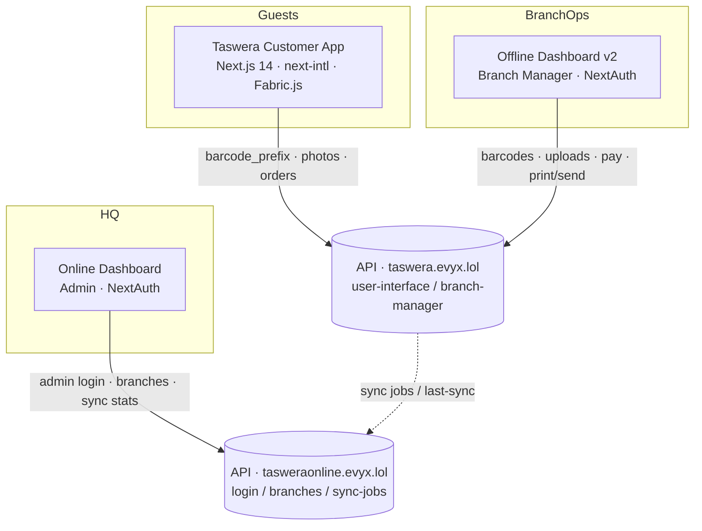

# TASWERA — Portfolio Case Study

> Event photo-booth platform: customer gallery + Fabric editor, branch operations dashboard, and central online admin.  
> Copy any section into your personal portfolio or case study.

---

## 1. Project Overview

**Taswera** (brand wordmark: **TASWERA**) is an end-to-end photo-booth product for events and venues. Guests receive a wristband with a **5-character barcode**, get photographed on-site, then open a kiosk/web experience to select photos, set print sizes, edit with frames/filters/stickers, and collect prints. Branch staff run upload → order → payment → print/send workflows. HQ admins manage branches and monitor sync health across locations.

| | |
|---|---|
| **Product type** | Multi-app event photo commerce + ops platform |
| **Primary users** | Event guests (booth), branch managers / photographers (ops), HQ admins |
| **Locales** | English + Arabic (`en` / `ar`) with full RTL |
| **Brand name** | TASWERA |
| **Primary color** | `#202020` (brand black / CTA fill) |
| **Supporting palette** | `#000000`, `#ffffff`, `#6d7278` (muted), `#F6F6F6` (banners), `#dddddd` (payment pills), `#bcbcbc` (dividers) |
| **Display font (EN)** | **Homenaje** |
| **Arabic font (dashboards)** | **Almarai** |
| **Signature UI** | Clip-path “frame” CTAs (`.custom-confirm-button`, `.custom-border-button`), logo header, soft `#EEEEEE80` card shadows |

### Who it’s for

- **Guests** at events who want to pick, customize, and print photos without an account — only barcode + phone.
- **Branch teams** (managers, photographers, staff) who generate barcodes, upload shoots, take payment, and fulfill print/digital delivery.
- **HQ / online admins** who onboard branches, watch sync jobs, and manage global frames & stickers.

---

## 2. My Role — Frontend Developer (React)

**Title:** Frontend Developer (React / Next.js)  
**Scope:** Owned the customer-facing booth experience and contributed across both operational dashboards in a three-app Next.js monorepo.

### Responsibilities

- Designed and implemented the **guest journey** from login → gallery → Fabric.js editor → print → checkout → thanks / download.
- Built **locale-aware (en/ar) RTL layouts** with `next-intl`, including mirrored CTAs and Arabic copy.
- Integrated **barcode-based auth** via cookies and middleware (no traditional customer accounts).
- Implemented **photo selection UX** with order badges, Small/Large quantity steppers, and selection cloning APIs.
- Built the **in-browser photo editor** (Crop, Frame, Filters, Stickers, Brightness) on Fabric.js with high-resolution export and upload.
- Delivered **dashboard UIs** for branch ops (barcodes, uploads, orders, print queues, ZIP, Excel/PDF exports) and HQ admin (branches, sync stats, payments filters).
- Established shared **design language**: `#202020` CTAs, Homenaje/Almarai typography, shadcn/Radix primitives, TanStack Query data layer.
- Handled **auth surfaces**: cookie gate for guests; NextAuth Credentials for admin and branch-manager logins.
- Maintained TypeScript forms with **react-hook-form + Zod**, toast feedback (Sonner), and App Router middleware.

### What I personally built / owned (highlight for resume)

- Full **Taswera customer app** screens: `/auth/login`, `/`, `/view-selected`, `/print`, `/cheak-out`, `/thanks`, `/download`.
- **Fabric editor pipeline**: canvas load, filters/frames/stickers, print-ready PNG export (e.g. 3000×4500), CORS image proxy.
- **Cookie + middleware access control** (`isLoggedIn`, `userCode`, `userPhone`, `isPaid` → download-only mode).
- Branch dashboard modules: barcode generation/reset, employee photo import folders, order create/pay/cancel, ready-to-print & printed-sent ZIP.
- Online dashboard: sync-job statistics cards/tables, branch CRUD with credential copy, payments Excel export, frames/stickers settings.
- **Bilingual product** (Homenaje + Almarai, `dir=rtl` for Arabic).

---

## 3. Problem / Solution

### Problem

Event photo booths traditionally force guests into slow, staff-dependent flows: find your photos, choose prints, wait for edits, pay, and collect — often with paper tickets and no self-serve editing. Operators need separate tools for barcode inventory, photographer uploads, shift-based payments, and print queues, while HQ needs visibility into whether branch data is syncing.

### Solution

Taswera splits the product into three frontends that share one domain model (**barcode → photos → order → print/send → sync**):

1. **Guest app** — wristband code + phone unlocks a branded gallery and Fabric editor on the booth/web.
2. **Offline (branch) dashboard** — day-of ops: generate barcodes, upload by photographer, create/pay orders, fulfill print & digital send, export reports.
3. **Online (HQ) dashboard** — manage branches and monitor sync-job health across the network.

Guests self-serve selection and customization; staff fulfill; HQ observes and configures.

---

## 4. High-Level Architecture



### Apps & backends

| Frontend | Backend host | Primary API prefixes |
|----------|--------------|----------------------|
| **Taswera** (customer) | `https://taswera.evyx.lol/api` | `user-interface/*`, `check-barcode` |
| **Offline dashboard** | `https://taswera.evyx.lol/api` | `branch-manager/*`, `temp/*`, sync proxies |
| **Online dashboard** | `https://tasweraonline.evyx.lol/api` | `/login`, `/branches`, `/sync-jobs/*`, `onlinedashboard/*` |

### Shared domain spine

`barcode_prefix` (5 chars) → compressed photos → selected/cloned photos → Fabric edits → `orders/create-from-selected` → pay with `shift_id` → `send_type`: `send` | `print` | `print_and_send` → printed folders / ZIP → sync jobs visible to HQ.

---

## 5. Full Feature Breakdown — Customer App (Taswera)

**Package:** `taswera@0.1.0` · Routes under `/[locale]/…`

### `/auth/login` — Entry & wristband login

- Full-bleed looping **login video** background with dark overlay.
- Clip-path **Union.svg “GO”** CTA (position/rotation mirrors for RTL).
- Frosted glass dialog (`backdrop-blur`, white/30): locale switcher, TASWERA logo, **5-char code** + **11-digit Egyptian phone** (Zod-validated).
- Submit via `addUserByQrCode` → `POST user-interface/assign/user-qr`; sets cookies `userCode`, `userPhone`, `isLoggedIn`, `userData`, `isPaid`.
- Paid users redirect to `/download`; others to gallery `/`.
- Supporting copy for “How it works” wristband flow exists in i18n (`how-it-works-step-1` … `6`).

### `/` — Photo gallery (homepage)

- Delayed loading state with spinner + camera-flash icon (“Loading your special moments…”).
- Fixed header: logo + **Logout** (border clip button) + **Confirm** (filled clip CTA).
- Responsive grid (2–4 columns) of compressed photos from `GET user-interface/compressed-photos?barcode_prefix=`.
- Tap to select: black border, **selection-order badge**, Small/Large quantity steppers (`+/−`).
- Eye preview opens Embla carousel dialog with select + qty controls.
- Confirm sends `select-and-clone-photos` then navigates to `/view-selected`.
- Enforces at least one quantity per selected photo (toast if zero).

### `/view-selected` — Review & Fabric editor

- Header (forced LTR chrome): back, logo, “Number of selected photos: i/n”.
- Carousel of selected photos with Large/Small type chips; chevron navigation.
- Edit mode: Fabric canvas (~375×563 working size), tools:
  - **Crop** — crop area add/apply/cancel
  - **Frame** — API frames overlaid on image
  - **Filters** — grayscale, sepia, vintage, bright, contrast, blur, invert, saturate, noir, etc.
  - **Stickers** — API stickers as Fabric objects
  - **Brightness** — adjustment panel
- Reset / deselect / delete-object actions; circular black check to apply.
- Export high-res PNG (e.g. 2250×3000 small / 3000×4500 large) → `selected-photos/:id/update`.
- Empty state: “Back to Gallery”.
- Image loads through `/api/proxy-image` to avoid CORS on Fabric `fromURL`.

### `/print` — Ready to print

- Logo header (no confirm).
- Gray banner `#F6F6F6`: “Ready to Print” + Printer icon.
- Grid of selected print-ready photos.
- Clip CTA **Print** → `orders/create-from-selected` (`PrintConfirmation`).

### `/cheak-out` — Checkout (note: route spelling)

- Banner “Check Out”.
- Horizontal thumb strip of order photos.
- Summary rows (Homenaje): Num of photos / Amount / Tax / Total with dashed divider.
- Payment method pills (`#dddddd`): **Cash**, **Insta Pay**, **Credit Card**.
- Check Out → `/thanks`; Cancel → `/print`.
- *Note: FE payment method selection is present; live payment-gateway wiring is backend/ops dependent — treat checkout totals as UI contract.*

### `/thanks` — Post-order confirmation

- “Thanks for using” + logo + `thanks.png` illustration.
- Collect hard copy within **15 minutes** messaging.
- QR (`react-qr-code`) pointing to guest login URL.
- **Done** CTA; auto-redirect to login after 15s.

### `/download` — Post-payment digital access

- Header: logo + **Download Selected** / **Download All** / **Log out**.
- Desktop QR block: “Scan to Access Photos on Mobile”.
- Selectable grid of selected photos; downloads via `/api/proxy-image` blob pipeline.
- Middleware: if `isPaid=true`, guest is restricted primarily to this surface.

### Supporting

- Catch-all `[...rest]` → not found.
- Packages concept (5 / 10 / 15 photos @ EGP tiers) defined in constants with WhatsApp delivery copy.

---

## 6. Separate Apps

### A. Offline Dashboard v2 — Branch operations

**Path:** `taswerah-offline-dashboard-v2`  
**Auth:** NextAuth Credentials → `POST branch-manager/login` (`phone` + `password`); session scopes to manager’s `branch`.  
**Nav:** `/` · `/barcodes` · `/employee-photos` · `/orders` · `/phone-numbers` · `/ready-to-print` · `/printed-sent` · `/shifts` · `/payments` · `/settings`

| Module | What it does |
|--------|----------------|
| **Dashboard `/`** | Photographers table + CRUD actions for branch staff/photographers. |
| **Barcodes `/barcodes`** | Paginated barcode list; filter used/unused; **GenerateBarcodesDialog**; **ResetBarcodesDialog** (admin email/password → `user-interface/reset-barcodes`). |
| **Employee photos `/employee-photos`** | Folder grid by uploaded barcode codes; **ImportPhotosDialog** maps folder name → 5-char prefix, multi-photographer select, upload via `temp/upload-photo` → approve `temp/approve-photos` / `photos/upload`. |
| **Orders `/orders`** | Active orders table; **CreateOrderDialog** (`orders/upload-and-create`); **PayDialog** (`orders_submit/:id` with `pay_amount` + `shift_id`); cancel by barcode. |
| **Phone numbers `/phone-numbers`** | Branch guest phone table; **Excel export** (`exportPhoneNumbersToExcel`). |
| **Ready to print `/ready-to-print`** | Folders per barcode ready for fulfillment; send via `SendPhotosAction` with `send_type` `print` / `send` / `print_and_send`. |
| **Printed / sent `/printed-sent`** | Historical folders (`send_type=print`); date filter UI; nested `/printed-sent/folder/[folderId]` grid; **ZIP download** (`/api/zip/[folderId]` + JSZip, split small vs large). |
| **Shifts `/shifts`** | CRUD shifts used when recording payments. |
| **Payments `/payments`** | Recharts area chart; clients table; filter dialog; **PDF export** (`@react-pdf/renderer`); sync status + filtered sync jobs + Excel export. |
| **Settings `/settings`** | Upload/manage **frames** & **stickers**; delete-many. |
| **Login `/auth/login`** | Phone + password for branch manager. |

### B. Online Dashboard — HQ admin

**Path:** `taswerah-online-dashboard`  
**Auth:** NextAuth Credentials → `POST /login` with `{ email, password, role: "admin" }`; JWT holds admin + Bearer token.  
**Nav:** `/` · `/branches` · `/payments` · `/settings` (`/employees` and `/packages` exist but are not primary nav)

| Module | What it does |
|--------|----------------|
| **Dashboard `/`** | Sync statistics cards (jobs, pay, photos, success %); last-sync clock; **BranchesLastSyncTable**; sync-jobs table with status badges (completed / failed / pending / synced); delete sync job. |
| **Branches `/branches`** | CRUD branches; table surfaces manager email/password/token with clipboard copy for booth provisioning. |
| **Employees `/employees`** | Tabs for staff + photographers; create/edit/delete/toggle status (route present; nav item commented). |
| **Packages `/packages`** | Package table UI (seed/mock-driven FE; not primary live API screen). |
| **Payments `/payments`** | Branch selector + **PaymentFilterDialog**; sync-job cards/table filtered by `branch_id`; **Excel export** of sync jobs (+ summary / employee photos sheets). |
| **Settings `/settings`** | Global frames & stickers gallery upload for customer editor assets. |
| **Login `/auth/login`** | Admin email/password. |

### How the three apps work together

1. Offline generates **barcodes** → guest enters code + phone on Taswera.  
2. Photographers **upload** under barcode → guest gallery appears.  
3. Guest selects, edits, confirms print → **order**.  
4. Branch **pays** (amount + shift) → moves to ready-to-print / print-and-send.  
5. Staff fulfill; ZIP archives for printed sets.  
6. Online HQ watches **sync-jobs** and manages branch credentials + shared creative assets.

---

## 7. Auth, Permissions & Dual Modes

### Customer (Taswera) — Cookie session

| Cookie | Purpose |
|--------|---------|
| `isLoggedIn` | Gate for authenticated routes |
| `userCode` | 5-char `barcode_prefix` |
| `userPhone` | 11-digit phone |
| `userData` | User JSON payload |
| `isPaid` | If `true`, force download-oriented access |

- Middleware + `next-intl` locale prefix.
- Public without login: `/auth/login`, `/thanks`.
- **No RBAC roles** on the guest client — only paid vs unpaid.
- `next-auth` package/provider scaffolding exists; real guest auth is **cookie-based**, not NextAuth Credentials.

### Branch manager (Offline) — NextAuth

- Credentials: phone + password → `branch-manager/login`.
- Session user = manager (`id`, `name`, `email`, `phone`, `branch`).
- Single operational role: **branch manager** (staff/photographer are data entities, not FE ACL).

### HQ admin (Online) — NextAuth

- Credentials: email + password + `role: "admin"`.
- Typed flags: `is_super_admin`, `permissions.view_dashboard`, `permissions.manage_branches` (typed on admin model; UI currently treats login as binary JWT presence).
- Employee role types in data: `"staff" | "photographer" | "admin"`.

### Dual online / offline mode

- **Offline mode (ops):** Branch can run barcodes → upload → order → pay → print against `taswera.evyx.lol` without using the HQ UI.
- **Online mode (HQ):** Aggregates sync statistics and branch admin on `tasweraonline.evyx.lol`.
- Both dashboards expose **last sync** and **filtered sync job** views (different API paths).

---

## 8. Tech Stack Tables

### Taswera (customer)

| Layer | Choices |
|-------|---------|
| Framework | Next.js **14.2.24** (App Router), React 18, TypeScript |
| Styling | Tailwind 3.4, shadcn/Radix, custom clip-path CTAs |
| Data | TanStack Query 5, Server Actions / fetch to `user-interface/*` |
| Forms | react-hook-form + Zod |
| i18n | next-intl 4 (`en`/`ar`) |
| Editor | Fabric.js 6 (npm) + Fabric 5.3 CDN canvas bootstrap |
| Media | Embla carousel, react-qr-code, js-cookie |
| Feedback | Sonner toasts, Vaul drawers |
| Auth | Cookie middleware (NextAuth present but unused for guests) |

### Online dashboard

| Layer | Choices |
|-------|---------|
| Framework | Next.js 14.2.24, React 18, TypeScript |
| Auth | next-auth 4 Credentials + JWT |
| Tables | @tanstack/react-table |
| Charts | chart.js + react-chartjs-2, recharts (partially wired) |
| Export | xlsx |
| UX | nuqs, cmdk, @dnd-kit, Sonner |
| i18n | next-intl · Homenaje (LTR) · Almarai (RTL) |

### Offline dashboard v2

| Layer | Choices |
|-------|---------|
| Framework | Next.js 14.2.24, React 18, TypeScript |
| Auth | next-auth 4 Credentials (branch-manager) |
| Tables | @tanstack/react-table |
| Charts | recharts |
| Export | xlsx, **@react-pdf/renderer**, react-pdf |
| Archives | **JSZip** + `/api/zip/[folderId]` |
| Dates | date-fns, react-day-picker |
| i18n | next-intl · Homenaje · Almarai |

---

## 9. Cross-Cutting Features

| Capability | Where |
|------------|--------|
| **i18n + RTL** | All three apps (`en`/`ar`, `dir` on `<html>`) |
| **QR codes** | Customer thanks + download (`react-qr-code`) |
| **Fabric.js editor** | Customer `/view-selected` |
| **Excel (xlsx)** | Online payments/sync export; offline sync + phone numbers |
| **PDF export** | Offline payments (`ExportDialog` / `@react-pdf/renderer`) |
| **ZIP download** | Offline printed-sent folders (small/large split) |
| **Image CORS proxy** | Customer `/api/proxy-image` |
| **Sync monitoring** | Online dashboard + offline payments sync panels |
| **Frames & stickers CMS** | Settings on both dashboards → consumed by guest editor |
| **Barcode lifecycle** | Generate / list / reset (offline) → guest login key |
| **Shift-linked payments** | Offline PayDialog requires `shift_id` |
| **FCM / push** | **Not implemented** in this codebase |
| **Maps / live chat** | **Not present** |

---

## 10. Feature Checklist

### Customer app

- [x] Video login hero + GO CTA
- [x] Barcode + phone login (Zod)
- [x] Locale switcher (en ↔ ar)
- [x] Photo gallery with multi-select
- [x] Selection order badges
- [x] Small / Large quantity steppers
- [x] Preview carousel dialog
- [x] Confirm → clone selected photos
- [x] Fabric editor (crop / frame / filters / stickers / brightness)
- [x] High-res edited photo upload
- [x] Ready-to-print grid + Print CTA
- [x] Checkout summary + payment method UI
- [x] Thanks page + QR + timed redirect
- [x] Download selected / all (paid flow)
- [x] Cookie middleware + paid gate
- [x] Image proxy for canvas CORS
- [ ] Live payment gateway on checkout (UI only / backend-dependent)

### Offline dashboard

- [x] Branch-manager NextAuth login
- [x] Photographers / staff management
- [x] Barcode generate + reset
- [x] Employee photo folder import + approve
- [x] Orders create / pay / cancel
- [x] Shifts CRUD
- [x] Ready-to-print fulfillment (`send` / `print` / `print_and_send`)
- [x] Printed-sent archive + ZIP
- [x] Phone numbers Excel export
- [x] Payments chart + PDF + sync Excel
- [x] Frames & stickers settings

### Online dashboard

- [x] Admin NextAuth login
- [x] Sync-job statistics & tables
- [x] Branches CRUD + credential copy
- [x] Payments filtered by branch + Excel export
- [x] Frames & stickers settings
- [x] Employees module (route; optional nav)
- [ ] Packages live API (UI/mock seed)
- [ ] Fine-grained FE RBAC enforcement for `permissions.*`

---

## 11. UX & Design Notes (Real Brand Patterns)

- **Brand first:** TASWERA logo is a persistent header signal on almost every guest screen — not a tiny nav mark.
- **Color system:** Near-monochrome premium look; primary action fill `#202020`; muted labels `#6d7278`; utility banners `#F6F6F6`.
- **Typography:** Homenaje for guest display UI; dashboards add Almarai for Arabic readability.
- **Signature controls:** Irregular clip-path buttons (cut corners) instead of generic rounded pills — distinctive booth aesthetic.
- **Guest flow:** Kiosk-friendly — large targets, few steps, video entry, minimal chrome.
- **Ops flow:** Sidebar + data tables, folder metaphor for barcode groups, dialogs for generate/pay/import.
- **RTL:** Login GO position flips; logo `rtl:self-end`; full `dir=rtl` on Arabic locale.
- **Motion:** Bounce on GO chevrons; hover brightness on clip CTAs; soft card shadow `#EEEEEE80` on editor stage.
- **Avoided:** Purple SaaS gradients; the product identity is black/white event photography.

---

## 12. Challenges & What I Learned

1. **Fabric.js + CORS + print resolution** — Loading remote photos onto canvas required a same-origin proxy; exporting for print meant careful multiplier math (e.g. 3000×4500) without blowing memory/WebGL texture limits (`Canvas2dFilterBackend`, capped `textureSize`).
2. **Barcode as identity** — Designing UX around a 5-character wristband code (not email/password) forced a custom cookie middleware model and paid-user routing.
3. **Three frontends, two APIs** — Keeping guest + branch on `taswera.evyx.lol` while HQ sits on `tasweraonline.evyx.lol` taught clear boundary thinking around sync jobs as the join story.
4. **RTL as a first-class layout** — Clip-path CTAs, mirrored GO, and bilingual fonts needed intentional CSS/`dir` work, not string translation alone.
5. **Ops density vs guest simplicity** — Same brand tokens across kiosk calm UI and dense admin tables; learned to reuse tokens without forcing one layout language onto both.
6. **Selection state complexity** — Order badges + dual size quantities + clone-before-edit pipeline required careful client state before hitting the editor.

---

## 13. Impact (Fill Metrics Later)

- Supported end-to-end guest self-serve from wristband scan to print/download across **[X events / branches]**.
- Reduced staff time per guest selection cycle by enabling self-serve gallery + editor — **[~Y% fewer assisted selections]** *(estimate when available)*.
- Branch ops consolidated barcodes, uploads, payments, and print queues into one dashboard used by **[N branch managers]**.
- HQ gained visibility into sync health across **[B branches]** with filterable sync-job exports.
- Shipped full **Arabic RTL** experience for guest + admin surfaces — **[% Arabic sessions]** *(if measured)*.
- Editor produced print-ready assets at up to **3000×4500** without leaving the browser.

---

## 14. Copy-Paste Blurbs

### Short (2–3 sentences)

I built **Taswera**, a Next.js photo-booth platform where event guests unlock photos with a wristband barcode, select sizes, and edit prints in a Fabric.js editor — with full English/Arabic RTL. I also shipped branch and HQ dashboards for barcodes, uploads, shift payments, print queues, ZIP/Excel/PDF exports, and sync monitoring across two API backends.

### Medium case study

**Taswera** is a multi-app event photography product. As Frontend Developer (React), I owned the customer booth app: cookie-based barcode login, gallery multi-select with Small/Large quantities, Fabric editing (crop, frames, filters, stickers, brightness), print confirmation, checkout UI, and post-pay download with QR. In parallel I delivered operational UIs for branch managers (barcode generation, photo import folders, orders/pay with shifts, ready-to-print and ZIP archives, Excel/PDF reports) and HQ admins (branch CRUD, sync-job analytics, asset settings). The stack is Next.js 14, TypeScript, TanStack Query, next-intl, NextAuth (dashboards), and a shared `#202020` / Homenaje brand system.

### Long narrative

Event photo booths usually trap guests in a staff-mediated loop: find shots, argue over sizes, wait for edits, pay, collect. **Taswera** turns that into a self-serve product while keeping operators in control. Guests walk up to a kiosk, enter a five-character wristband code and phone number, and land in a branded gallery powered by their barcode. They select photos, set Small/Large print quantities, refine images in a Fabric.js editor with frames and stickers managed from admin settings, then confirm print and checkout. Paid guests return later via a download surface with QR access.

Behind the booth, the **offline dashboard** is the day-of control room: generate and reset barcodes, import photographer folders, create and pay orders against shifts, push jobs to ready-to-print or digital send, and archive printed sets as ZIPs. The **online dashboard** is HQ: provision branches (including manager credentials), watch sync-job statistics, filter payments by branch, and maintain the creative asset library. I implemented these React/Next.js frontends with bilingual RTL, TanStack data fetching, Zod forms, and a distinctive clip-path button language tied to the TASWERA brand (`#202020`, Homenaje). The hardest engineering was making the editor production-print reliable (CORS proxy, 2D filter backend, high-DPI export) while keeping three apps aligned on one barcode-centric domain model.

---

## 15. Portfolio Tags

`Next.js` · `React` · `TypeScript` · `Tailwind CSS` · `shadcn/ui` · `TanStack Query` · `TanStack Table` · `next-intl` · `RTL` · `i18n` · `NextAuth` · `Fabric.js` · `Photo Editor` · `QR Code` · `Cookie Auth` · `Middleware` · `Zod` · `react-hook-form` · `Recharts` · `Excel Export` · `PDF Export` · `JSZip` · `Event Tech` · `Photo Booth` · `Multi-tenant Branches` · `Dashboard UX` · `Arabic Localization`

---

## 16. Suggested Screenshots Mapping (`preview-shots/`)

Use these static HTML previews (1280×720) as portfolio visuals. Open in a browser and screenshot.

### Marketing / brand (no copy-heavy UI)

| File | Use in portfolio as |
|------|---------------------|
| `preview.html` (root) | Hero device mock — main product showcase |
| `preview-shots/01-marketing-homepage.html` | Gallery product shot |
| `preview-shots/03-marketing-edit-tools.html` | Editor capability highlight |
| `preview-shots/05-marketing-print-workflow.html` | Print workflow atmosphere |
| `preview-shots/06-brand-splash-a.html` | Brand splash (video + white logo) |
| `preview-shots/11-brand-splash-b.html` | Alternate brand composition |

### App-realistic (browser chrome, LTR)

| File | Maps to real route |
|------|--------------------|
| `02-app-login.html` | `/[locale]/auth/login` |
| `04-app-gallery.html` | `/[locale]/` gallery |
| `07-app-view-selected.html` | `/[locale]/view-selected` |
| `08-app-print.html` | `/[locale]/print` |
| `09-app-checkout.html` | `/[locale]/cheak-out` |
| `10-app-thanks.html` | `/[locale]/thanks` |
| `12-app-download.html` | `/[locale]/download` |
| `13-app-loading.html` | Gallery loading state |

### App-realistic RTL (Arabic)

| File | Maps to |
|------|---------|
| `14-app-login-rtl.html` | Login AR |
| `15-app-gallery-rtl.html` | Gallery AR |
| `16-app-checkout-rtl.html` | Checkout AR |
| `17-app-thanks-rtl.html` | Thanks AR |
| `18-app-print-rtl.html` | Print AR |
| `19-app-editor-rtl.html` | Editor AR |
| `20-app-download-rtl.html` | Download AR |

> Tip: Pair **04** + **07** + **08** for a guest-journey strip; pair **06** with logo close-ups for brand; include one RTL shot to prove localization depth. Dashboard screenshots should be captured live from `taswerah-offline-dashboard-v2` / `taswerah-online-dashboard` (not in `preview-shots/`).

---

## 17. Repo Structure

```
Tasweara/
├── PORTFOLIO.md                 ← this document
├── preview.html                 ← marketing preview shell
├── preview-shots/               ← static 1280×720 HTML screenshots (LTR + RTL)
│   ├── photos/                  ← non-people scenic placeholders for mocks
│   └── _shared.css
│
├── Taswera/                     ← Customer booth / gallery app (taswera)
│   ├── public/assets/           ← logo, video, editor icons, frames, stickers
│   └── src/
│       ├── app/[locale]/        ← login, gallery, editor, print, checkout, thanks, download
│       ├── components/          ← header, providers, ui (shadcn)
│       ├── i18n/                ← en.json / ar.json, routing
│       ├── lib/api/             ← photos, frames, stickers
│       └── middleware.ts        ← cookie + locale gate
│
├── taswerah-offline-dashboard-v2/   ← Branch manager ops
│   └── src/app/[locale]/           ← barcodes, uploads, orders, print queues, payments…
│
└── taswerah-online-dashboard/       ← HQ admin
    └── src/app/[locale]/           ← sync dashboard, branches, payments, settings
```

Each app is an independent Next.js project (own `package.json` / git history) sharing brand tokens and the barcode-centric domain model — not a single npm workspace.

---

## Quick Reference — Guest Journey

```
Login (code + phone)
  → Gallery (select + Small/Large qty)
    → View-selected (Fabric edit)
      → Print
        → Checkout
          → Thanks
            ↘ (if paid) Download only
```

---

*Document generated from the Tasweara codebase. Replace `[bracketed]` impact placeholders with your real metrics before publishing.*
