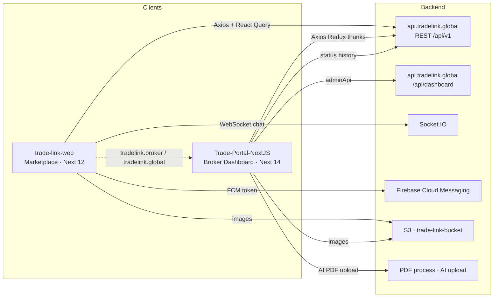

# Trade Link — Portfolio Case Study

> Frontend product suite for a B2B commodity / brokerage marketplace.  
> Copy any section below into your personal portfolio or case study.

---

## 1. Project overview

**Trade Link** is a dual-frontend platform that connects buyers, sellers, and brokers around tradable goods (commodities, energy, textiles, raw materials, food & beverages, and more). The product has two complementary surfaces:

| Surface | Package | Audience |
|---------|---------|----------|
| **Public marketplace** | `trade-link-web` | Visitors, buyers, and brokers discovering products and initiating deals |
| **Broker / admin portal** | `Trade-Portal-NextJS` (`portal-trade-app`) | Brokers managing catalog, suppliers, transactions, and network; admins managing categories and brokers |

**Who it’s for:** Independent brokers (“Prolancer”), brokerage firms, and supplier firms who need a shared place to list products, discover counterparties, chat about deals, and move transactions through a defined lifecycle — plus platform admins who curate categories and broker accounts.

**Brand identity (from codebase):**

| Token | Value |
|-------|--------|
| Brand name | **Trade Link** |
| Primary accent | `#4680FF` (`mainBlue`) |
| Logo blues | `#044199`, `#005BE7`, `#5F99FF` |
| Wordmark | `#1E1E1E` |
| Body / heading | `#5A5A5A` / `#212121` (storefront); `#5B6B79` / `#1D2630` (portal) |
| Portal chrome bg | `#F8F9FA` |
| Storefront fonts | **Open Sans** (UI) + **Satisfy** (page-header flourish) |
| Portal fonts | **Inter** (live UI) / Roboto (template config) |
| Logo assets | Storefront: `/assets/images/logo.svg` · Portal: `/assets/images/drawer-logo.svg`, `Logo.png` |
| Public site refs | `www.tradelink.broker` · Explore CTA `tradelink.global` |
| API host | `api.tradelink.global` |
| Author org (SEO) | xai-technology, Inc. |

---

## 2. My role — Frontend Developer (React)

**Role:** Frontend Developer (React) — end-to-end ownership of the client experiences for both the public marketplace and the broker dashboard.

### Scope I owned

- Built and maintained the **Trade Link storefront** (Next.js Pages Router + React 18 + Tailwind): home, explore, category/collection browse, broker directory & profiles, product detail with deal CTA, auth UI, account surfaces, and real-time chat.
- Built and maintained the **Broker’s Dashboard portal** (Next.js 14 + MUI + Redux Toolkit): analytics dashboard, product/supplier/transaction DataGrids, transaction timeline, trade-network org chart, multi-step onboarding, and admin-only brokers/categories management.
- Integrated authenticated REST clients (Axios interceptors, access/refresh cookies, 401 refresh queues) against `api.tradelink.global` and the admin dashboard API.
- Implemented **Socket.IO messaging**, conversation create/check flows from product pages, and Firebase Cloud Messaging registration on the storefront.
- Delivered **i18n + RTL** on the marketplace (en / ar / fr) with `next-i18next` and `tailwindcss-rtl`.
- Shipped **Excel export**, AI-assisted product intake (PDF → form), PWA manifests, S3 image domains, and role-based navigation (broker vs admin).

### Responsibilities (portfolio phrasing)

- Translated product requirements into reusable React components, page layouts, and typed API hooks.
- Owned UI consistency with Trade Link brand tokens (`#4680FF`, logo SVGs, Open Sans / Inter) across two design systems (Tailwind storefront + MUI portal).
- Guarded routes with Next.js middleware (storefront `/chats`; portal public vs admin paths).
- Collaborated with backend contracts for auth, products, brokers, conversations, transactions, status history, and invite trees.
- Hardened client UX: skeletons, empty states, sticky filters, DataGrid toolbars, pagination, toasts/snackbars, and responsive drawers.

---

## 3. Problem / solution

### Problem

Commodity and brokerage deals are fragmented: buyers struggle to find verified brokers and listings; brokers juggle catalogs, suppliers, and deal status across email and spreadsheets; there is no shared transaction lifecycle from “initiated” to “completed,” and no single place to chat in context of a product.

### Solution

Trade Link provides:

1. A **public marketplace** to discover categories, products, and brokers, then **Chat For A Deal** into a conversation tied to a product/supplier.
2. A **broker portal** to CRUD products and suppliers, track transactions through a six-step status timeline, invite colleagues into a **Trade Network** tree, and (for admins) govern categories and brokers.
3. Shared identity via email auth, JWT cookies, refresh rotation, and role-aware navigation (`admin` vs broker).

---

## 4. High-level architecture



**Text diagram**

```
[Browser]
   ├─ trade-link-web  ──REST/React Query──► api.tradelink.global/api/v1
   │                 ──Socket.IO──────────► api.tradelink.global
   │                 ──FCM────────────────► Firebase (tradelink-87f41)
   │                 ──images─────────────► S3 trade-link-bucket
   │
   └─ portal-trade-app ──REST/Redux───────► NEXT_PUBLIC_API_URL (v1)
                       ──adminApi─────────► …/api/dashboard
                       ──status history───► …/entity-status-history
                       ──AI PDF───────────► …/pdf/process
```

---

## 5. Full feature breakdown — Marketplace (`trade-link-web`)

### Home `/`
Full-width hero (`hero-header.jpg`), **Trade By Category** carousel (`CategoryBlock`), **Newest Products** grid (`NewHomeFeed` → `ProductCard` + vendor card), Explore CTA. Layout: fixed header (logo, Categories, Brokers, language, chat icon `#4680FF`, Sign In), footer widgets, mobile bottom nav.

### Explore `/explore`
Sticky left **Filters** (`ShopFilters` + `CategoryFilter`), breadcrumbs Home / Search, sort top bar (`SearchTopBar`), infinite product grid (`ExploreProductGrid`). Query-driven category chips (`?category=`).

### Products listing `/products`
Similar shop layout with optional discount strip; filters + `ProductGrid`.

### Product detail `/products/[slug]`
Gallery (`ProductDetailsImages`), title, description, primary CTA **Chat For A Deal** (`text-ChatForADeal`), `VendorCard` for the listing broker, detail tabs (`ProductDetailsTaps`). Unauthenticated users open login modal; authorized users call `POST /conversations/checkOrCreate` and navigate to `/chats?conversationId=`.

### Brokers `/brokers`
Paginated broker card grid (`NewBrokerCard`): avatar, name, company type (e.g. Prolancer), like score, country flag (`flagcdn.com`). **Load More** pagination.

### Broker profile `/brokers/[slug]`
Sidebar (`ShopSidebar`): photo, bio, country, language, phone, share. Product grid for that broker’s listings; mobile drawer for more info.

### Category `/category/[slug]`
Category banner + `CategoriesProductGrid`.

### Collections `/collections/[slug]`
Collection filters sidebar + product grid (secondary browse path).

### Chat `/chats` *(middleware-protected)*
Conversation list + chat area; Socket.IO to `api.tradelink.global` (`joinRoom` / message events). Zustand `useMessagesStore`. Footer hidden on chats. Transaction widgets under `components/transaction/` can attach deal context to conversations.

### Auth pages
- `/signin`, `/signup`, `/forget-password` — forms + pattern page header (`app-pattern.png`).
- Modal auth: `LOGIN_VIEW` / `SIGN_UP_VIEW` / `FORGET_PASSWORD` via `useUIStore`.
- APIs: `POST /auth/email/login`, `/auth/email/register`, `GET /auth/me`, `POST /auth/logout`, refresh on 401.

### Account `/my-account/*`
Dashboard, account details, change password, orders list + order detail. (Not middleware-gated; client auth flag.)

### Checkout / order
`/checkout` (form + summary), `/order` confirmation. Checkout mutation is largely scaffolding (logs / passthrough) — UI present from ecommerce template heritage.

### Support / legal
`/contact-us`, `/faq`, `/terms`, `/privacy`, custom `/404`.

### Template leftovers (not primary UX)
`/classic`, `/minimal`, `/vintage`, `/contemporary`, `/ancient` — alternate homepage themes from the Chawkbazar-style base.

---

## 6. Full feature breakdown — Broker Portal (`Trade-Portal-NextJS`)

### Login `/login`
Centered card over auth background blobs: Email, Password, **Login** (`#4680FF`). Sets cookies, loads `/auth/me`, redirects to `/dashboard`, may show “Welcome Back!” dialog.

### Dashboard `/dashboard`
Title **Dashboard**. KPI row: **Products**, **Suppliers**, **Buyers**, **Transactions** (`EcommerceIncome` sparklines). Commission Performance line chart, Overview card, Top Brokers, Commission Categories donut, Trending Products, Top Suppliers, Transaction Status pie. Footer © Trade Link.

### Product Management `/products/list`
DataGrid columns: Product, Supplier, Country, Category, Commission, Status, Actions. Toolbar: Search, Export (xlsx), **Add Products Using AI** (PDF → `/pdf/process`), **Add Product**. Create/edit at `/products/[id]` (Formik). Brokers: `GET /products/my`; admins: admin list (Add/AI/Delete hidden for admins).

### Suppliers `/suppliers/list`
DataGrid: Supplier, Country, E-mail, Contact, Actions. Export + Add. Detail `/suppliers/[id]`.

### Transactions `/transactions/list`
Columns: Transaction No., Seller, Buyer, Status, Next Step, Actions. Excel export. Detail `/transactions/profile/[transactionId]`.

### Transaction detail — timeline
Products card + vertical timeline:

1. Transaction Initiated (status **6**)  
2. Under Production (**7**)  
3. Shipped (**8**) — shipping docs upload  
4. Delivered (**9**)  
5. Payment Completed (**10**)  
6. Transaction Completed (**11**)  

Buyer/seller role derived from `brokerFromId` / `brokerToId`. Status updates via entity-status-history API. Related: `/transactions/SelectProduct`.

### Trade Network `/Tradenetwork/list`
**Invite Broker** CTA + org chart (`react-organizational-chart`) from `POST /users/Tree`. Invite: `POST /auth/email/invite`. Remove broker from network supported.

### Profile `/profile`
Tabs: Profile, Professional Info, Account Settings (credentials, specializations, categories).

### Onboarding `/on-boarding/*`
Invite hash JWT → Set New Profile → **Welcome To TradeLink!** role cards (**Supplier Firm** / **Brokerage Firm** / **Prolancer**) → company/freelancer profiles → verification → terms (`UpdateOnboarding`) → login. Optional **choose-product** (manual vs smart upload) → upload steps → dashboard. Invitation landing embeds login.

### Admin-only
- `/brokers` — all brokers table (`/allBroker`), export  
- `/categories` — category/subcategory CRUD cards  

### Password change `/password-change`
Public reset/change flow.

---

## 7. Auth, RBAC & dual modes

### Marketplace auth
- Cookies: `accessToken`, `refreshToken`, `tokenExpires` (login via `cookies-next`).
- Axios `http` / `httpv2`: Bearer header; 401 → refresh queue; clear session on failure.
- Session restore: `GET /auth/me` on app load → `useUIStore.authorize()`.
- Middleware protects **only** `/chats` (redirect home if no `accessToken`).
- Dual UI modes: guest (Sign In / modals) vs authorized (profile icon, chats, deal CTA).

### Portal auth & RBAC
- Same cookie model + `isAdmin` cookie from JWT `role.name === "admin"`.
- Middleware: public `/login`, `/on-boarding`, `/password-change`; admin-only `/categories`, `/brokers`; else require token → `/login`.
- Nav dual mode:
  - **Broker:** Dashboard, Suppliers, Product Management, Transactions, Trade Network  
  - **Admin:** Dashboard, Categories, Brokers, Product Management, Transactions, Trade Network  
- Data dual mode: broker-scoped endpoints (`/products/my`, `/suppliers/all/my`) vs `adminApi` (`https://api.tradelink.global/api/dashboard`).
- Shell: permanent drawer (`Broker's Dashboard` title) + top bar with **tradelink.global** pill and notifications.

---

## 8. Tech stack tables

### Marketplace — `trade-link-web` `0.1.0`

| Layer | Choices |
|-------|---------|
| Framework | Next.js **12.3.1** (Pages Router) |
| UI | React 18, Tailwind 3, Headless UI, Framer Motion, Swiper |
| Data | React Query 3, Axios, IndexedDB cache (`cachedHttp`, `pwa_store`) |
| State | Zustand (`useUIStore`, `useMessagesStore`) |
| i18n | next-i18next — **en / ar / fr**, RTL via `tailwindcss-rtl` |
| Realtime | Socket.IO client (+ local `/api/socket` option) |
| Push | Firebase Messaging (`tradelink-87f41`) |
| PWA | next-pwa, `manifest.json` |
| Forms | react-hook-form |
| Fonts | @fontsource Open Sans + Satisfy |
| Icons | iconsax-react, react-icons |

### Portal — `portal-trade-app` `0.1.0`

| Layer | Choices |
|-------|---------|
| Framework | Next.js **14.2.2** (Pages Router) |
| UI | MUI 5, MUI X DataGrid / Date Pickers / Lab |
| State | Redux Toolkit + React Redux |
| HTTP | Axios (`API` + `adminApi`) |
| Charts | ApexCharts / react-apexcharts |
| Org chart | react-organizational-chart (+ apextree dep) |
| Forms | Formik + Yup |
| Export | **xlsx** |
| Auth helpers | js-cookie, jwt-decode, jsonwebtoken; next-auth SessionProvider wrapper |
| Motion | Framer Motion |
| PDF | @react-pdf/renderer; AI PDF ingest endpoint |
| PWA | next-pwa (“TradeLink Dashboard”) |
| DnD | @hello-pangea/dnd |
| Notify | notistack |

---

## 9. Cross-cutting features

| Feature | Where | Notes |
|---------|-------|-------|
| **i18n + RTL** | Storefront | en/ar/fr locale JSON; `dir` on `<Html>`; language switcher reloads |
| **i18n scaffolding** | Portal | react-intl in deps; UI mostly English hardcoded |
| **FCM push** | Storefront | Token registered via `firebase-controller/GetUserFCMToken` |
| **Excel export** | Portal | Products, suppliers, brokers, transactions → `.xlsx` |
| **AI product upload** | Portal | “Add Products Using AI” — PDF → `/pdf/process` → prefill `/products/new` |
| **Socket chat** | Storefront | Product → conversation → `/chats` |
| **S3 images** | Both | `trade-link-bucket.s3.amazonaws.com` (+ regional) |
| **Flag CDN** | Both | Country flags on brokers/suppliers |
| **PWA** | Both | Production service workers; storefront + dashboard manifests |
| **Cookie consent** | Storefront | `CookieBar` + `useAcceptCookies` |
| **SEO** | Storefront | next-seo `DefaultSeo` / per-page |
| **Offline-ish API cache** | Storefront | IndexedDB for products/categories/brokers GETs |
| **Invite JWT onboarding** | Portal | `?hash=` decode → invited broker context |
| **Transaction status history** | Portal | Shared entity-status-history endpoints |

---

## 10. Feature checklist

### Marketplace
- [x] Home hero + category carousel + newest products
- [x] Explore with category filters & product grid
- [x] Product detail + **Chat For A Deal**
- [x] Brokers directory + broker profile storefront
- [x] Category & collection browse
- [x] Auth (login / register / forget password) + modal auth
- [x] Session restore (`/auth/me`) + refresh tokens
- [x] Protected chats route (middleware)
- [x] Socket.IO messaging UI
- [x] i18n en/ar/fr + RTL
- [x] Firebase Cloud Messaging registration
- [x] PWA + IndexedDB API cache
- [x] Contact, FAQ, terms, privacy, 404
- [x] My Account / orders UI surfaces
- [ ] Full checkout API (UI present; mutation largely stubbed)
- [ ] Live newsletter subscription (component commented out)

### Portal
- [x] Login + cookie JWT + refresh
- [x] Broker vs admin drawer RBAC
- [x] Dashboard KPIs & charts
- [x] Product Management CRUD + AI PDF upload
- [x] Suppliers CRUD + export
- [x] Transactions list + Excel export
- [x] Transaction timeline (statuses 6–11)
- [x] Trade Network org chart + invite
- [x] Multi-step onboarding (role → profile → terms)
- [x] Admin brokers & categories
- [x] Profile / professional settings
- [x] Password change
- [x] PWA dashboard manifest
- [ ] Portal UI localization (config only)

---

## 11. UX & design notes

- **Storefront pattern:** White fixed header (~70px), `#4680FF` chat/CTA accents, Open Sans body, Satisfy on pattern page headers (`app-pattern.png` + 50% black overlay). Category circles on `#E2E8F0`. Broker cards on `#FAFBFB` with soft dividers.
- **Portal pattern:** Able Pro–descended MUI shell — `#F8F9FA` chrome, dashed `#CFD1D4` sidebar border, active nav `#4680FF` on `#EDF3FF`, pill **tradelink.global** CTA, white `MainCard` / DataGrid surfaces, KPI icon tiles (`#EDF3FF`, `#FFF5E5`, `#EBFAF5`).
- **Deal-centric UX:** Marketplace emphasizes discovery → chat; portal emphasizes ops tables → timeline advancement — same brand blue ties the two apps.
- **Avoid fashion-template noise in portfolio shots:** Prefer Home / Explore / Brokers / Product / Dashboard / Transactions over classic/vintage demos.

---

## 12. Challenges & what I learned

1. **Two design systems, one brand** — Keeping Tailwind storefront and MUI portal aligned on `#4680FF`, logo assets, and Trade Link naming without a shared component library.
2. **Auth across surfaces** — Cookie JWT + refresh queues, storefront middleware only on chats, portal middleware for admin paths; teaching the difference between UI “authorized” flags and real route guards.
3. **Realtime + REST** — Bridging product detail → `checkOrCreate` conversation → Socket.IO rooms while keeping SSR-safe Axios (skip SSR requests).
4. **RBAC data scoping** — Broker `*/my` endpoints vs hardcoded `adminApi` dashboard base; hiding AI upload/delete for admins.
5. **Template debt** — Chawkbazar/Able Pro leftovers (theme demos, stub checkout, unused next-auth/i18n) vs production Trade Link flows; learning to ship domain features without rewriting the whole template.
6. **Transaction lifecycle UI** — Encoding status IDs 6–11 as a vertical timeline with role-aware buyer/seller actions and document upload on Shipped.
7. **i18n/RTL** — Implementing real ar/fr packs and `dir` switching on the marketplace; recognizing portal i18n was scaffolding only.
8. **Performance UX** — React Query infinite lists, IndexedDB GET cache, DataGrid pagination, and PWA registration for repeat broker visits.

---

## 13. Impact bullets *(fill metrics)*

- Delivered a **two-app Trade Link frontend** covering public discovery and authenticated broker operations on a shared API (`api.tradelink.global`).
- Enabled deal initiation from product pages into **chat + transaction** workflows instead of off-platform email.
- Gave brokers a single **Product / Supplier / Transaction** ops console with Excel export and AI PDF intake.
- Supported **[X]** broker onboarding paths (Supplier Firm / Brokerage Firm / Prolancer) with invite-hash registration.
- Shipped **3-locale** marketplace experience (en/ar/fr) including RTL for Arabic.
- Hardened session UX with **refresh-token rotation** and role-gated admin routes (`/brokers`, `/categories`).
- *[Optional]* Reduced time-to-list for new products via **Add Products Using AI** by **[~X%]**.
- *[Optional]* Supported **[~X]** monthly transactions advanced through the portal timeline.
- *[Optional]* Marketplace PWA + FCM improved return engagement by **[~X%]**.

---

## 14. Copy-paste blurbs

### Short (2–3 sentences)

I built the frontend for **Trade Link**, a B2B brokerage marketplace with a public Next.js storefront and an MUI broker dashboard. Shoppers discover products and brokers, then start deal chats; brokers manage catalogs, suppliers, transactions, and invite networks with admin RBAC. Stack highlights: React 18, Next.js, Tailwind/MUI, React Query/Redux, Socket.IO, Firebase messaging, and Excel/AI upload tooling.

### Medium case study

**Trade Link** solves fragmented commodity brokerage by pairing a discovery marketplace with a broker operations portal. As Frontend Developer (React), I owned both clients: the Tailwind storefront (explore, brokers, product “Chat For A Deal,” i18n/RTL, Socket.IO chat, FCM) and the portal (dashboard analytics, DataGrid CRUD, six-step transaction timeline, Trade Network org chart, onboarding, admin categories/brokers). I integrated cookie JWT auth with refresh rotation, dual API bases for broker vs admin data, and brand-consistent UI around `#4680FF` and the Trade Link logo. The result is a coherent path from public listing → conversation → tracked transaction inside one product family.

### Long narrative

Commodity deals usually live in inboxes and spreadsheets. Trade Link’s product vision was a shared digital venue: buyers and brokers meet on a branded marketplace; brokers then run the back office—inventory, counterparties, and deal status—in a dedicated dashboard.

I joined as **Frontend Developer (React)** and took ownership of both React/Next applications. On **trade-link-web**, I shaped the Pages Router storefront: hero and category discovery, explore filters, broker cards with country context, product detail with a primary **Chat For A Deal** action that creates or resumes a conversation, and a protected `/chats` experience backed by Socket.IO. I wired email auth, session restore, and Axios refresh logic; delivered English, Arabic, and French with RTL; and registered Firebase Cloud Messaging plus PWA caching for a more app-like return visit.

On **Trade-Portal-NextJS**, I implemented the **Broker’s Dashboard** shell—drawer navigation that swaps for admins—and the operational modules brokers use daily: Product Management (including AI PDF upload), Suppliers, Transactions with xlsx export, a status timeline from Initiated through Completed, and a Trade Network tree with email invites. Middleware and JWT role claims keep `/brokers` and `/categories` admin-only while brokers stay on scoped `/my` APIs.

Working across Tailwind and MUI forced deliberate brand discipline (`#4680FF`, shared logo SVGs, Trade Link naming) and honesty about template heritage versus shipping features. The portfolio story is not “another ecommerce site”—it is a **deal-centric brokerage platform** with public discovery and authenticated ops in one system.

---

## 15. Portfolio tags

`React` · `Next.js` · `TypeScript` · `Tailwind CSS` · `MUI` · `Redux Toolkit` · `React Query` · `Zustand` · `Axios` · `Socket.IO` · `Firebase FCM` · `PWA` · `i18n` · `RTL` · `JWT Auth` · `RBAC` · `DataGrid` · `Excel Export` · `ApexCharts` · `B2B Marketplace` · `Broker Portal` · `Realtime Chat` · `Formik` · `Framer Motion`

---

## 16. Suggested screenshots mapping

Use files under `preview-shots/` and root `preview.html` (1280×720 static HTML).

| File | Use in portfolio | Type |
|------|------------------|------|
| `preview.html` | Hero / cover mock | Marketing |
| `01-homepage-showcase.html` | Marketplace visual | Marketing |
| `03-broker-network.html` | Broker discovery capability | Marketing |
| `05-product-deal-flow.html` | Deal CTA story | Marketing |
| `06-brand-splash-a.html` / `11-brand-splash-b.html` | Brand slides | Marketing |
| `02-home.html` | Home UI | App — storefront |
| `04-explore.html` | Filters + catalog | App — storefront |
| `07-brokers.html` | Brokers directory | App — storefront |
| `08-product-detail.html` | Chat For A Deal | App — storefront |
| `09-broker-profile.html` | Broker storefront | App — storefront |
| `10-category.html` | Category browse | App — storefront |
| `12-contact-us.html` / `13-faq.html` | Support surfaces | App — storefront |
| `14-portal-login.html` | Portal entry | App — portal |
| `15-portal-dashboard.html` | Analytics hub | App — portal |
| `16-portal-products.html` | Product Management | App — portal |
| `17-portal-suppliers.html` | Suppliers | App — portal |
| `18-portal-transactions.html` | Transactions list | App — portal |
| `19-portal-transaction-detail.html` | Status timeline | App — portal |
| `20-portal-trade-network.html` | Org chart / invites | App — portal |
| `21-portal-onboarding.html` | Role selection | App — portal |

**Case study sequence suggestion:** brand splash → home → explore → product deal → brokers → portal login → dashboard → products → transaction timeline → trade network.

---

## 17. Repo structure

```
trade-link/
├── preview.html                 # Marketing preview (root)
├── preview-shots/               # 1280×720 HTML screenshot pages
├── PORTFOLIO.md                 # This file
├── trade-link-web/              # Public marketplace (Next 12)
│   ├── public/                  # assets, locales en/ar/fr, PWA, FCM SW
│   ├── src/
│   │   ├── pages/               # Routes (index, explore, brokers, chats, …)
│   │   ├── components/          # UI, layout, product, chats, auth, …
│   │   ├── containers/          # Section compositions
│   │   ├── framework/basic-rest/# Axios + React Query API layer
│   │   ├── actoins/             # Conversations, transactions, categories
│   │   ├── store/               # Zustand
│   │   ├── settings/            # site-settings, FAQ, terms, privacy
│   │   ├── middleware.ts        # Protects /chats
│   │   └── utils/               # routes, firebase, i18n direction, cache
│   ├── package.json             # name: trade-link-web
│   └── tailwind.config.js
└── Trade-Portal-NextJS/         # Broker / admin portal (Next 14)
    ├── public/                  # drawer-logo, onboarding art, PWA
    ├── src/
    │   ├── pages/               # dashboard, products, suppliers, transactions, …
    │   ├── components/          # tables, dashboard widgets, transactions, …
    │   ├── core/components/     # Drawer, NavBar, layout
    │   ├── redux/               # slices, API, adminApi, store
    │   ├── hooks/               # useIsAdmin, setAuthCookies, …
    │   ├── sections/            # auth forms, charts
    │   └── middleware.ts        # Auth + admin route gates
    └── package.json             # name: portal-trade-app
```

---

*Generated from the Trade Link monorepo codebase. Replace `[X]` / `[~X%]` placeholders with your real metrics before publishing.*
